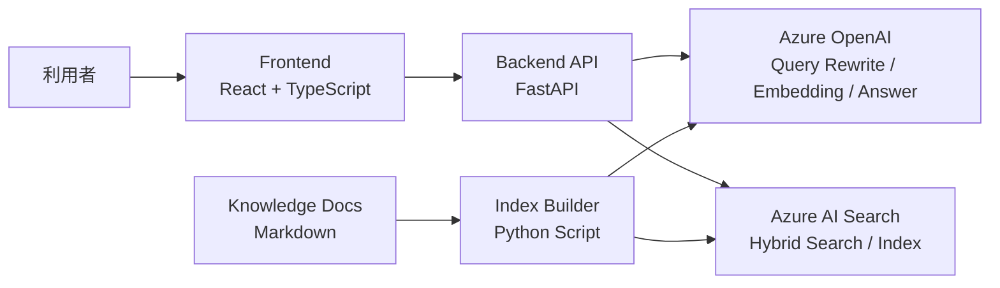
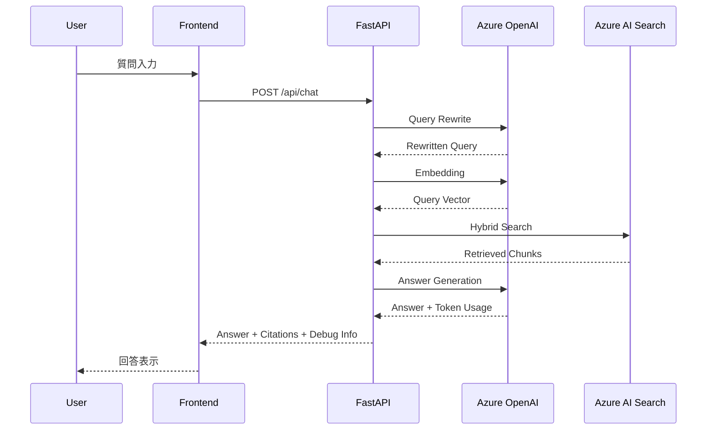
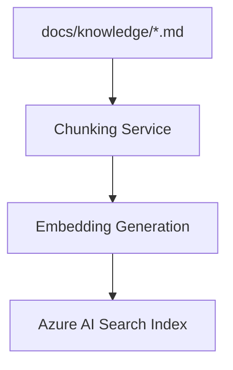

# Architecture Diagram

以下は Markdown 形式でそのまま使える簡易アーキテクチャ図です。  
GitHub、Typora、Mermaid 対応エディタへの貼り付けを想定しています。

## システム全体図

```mermaid
flowchart LR
    user["利用者"]
    fe["Frontend\nReact + TypeScript"]
    be["Backend API\nFastAPI"]
    aoai["Azure OpenAI\nQuery Rewrite / Embedding / Answer"]
    ais["Azure AI Search\nHybrid Search / Index"]
    docs["Knowledge Docs\nMarkdown"]
    builder["Index Builder\nPython Script"]

    user --> fe
    fe --> be
    be --> aoai
    be --> ais
    docs --> builder
    builder --> aoai
    builder --> ais
```

## 問答処理フロー

```mermaid
sequenceDiagram
    participant U as User
    participant FE as Frontend
    participant API as FastAPI
    participant OAI as Azure OpenAI
    participant AIS as Azure AI Search

    U->>FE: 質問入力
    FE->>API: POST /api/chat
    API->>OAI: Query Rewrite
    OAI-->>API: Rewritten Query
    API->>OAI: Embedding
    OAI-->>API: Query Vector
    API->>AIS: Hybrid Search
    AIS-->>API: Retrieved Chunks
    API->>OAI: Answer Generation
    OAI-->>API: Answer + Token Usage
    API-->>FE: Answer + Citations + Debug Info
    FE-->>U: 回答表示
```

## ナレッジ投入フロー

```mermaid
flowchart TD
    md["docs/knowledge/*.md"]
    chunk["Chunking Service"]
    embed["Embedding Generation"]
    index["Azure AI Search Index"]

    md --> chunk
    chunk --> embed
    embed --> index
```

