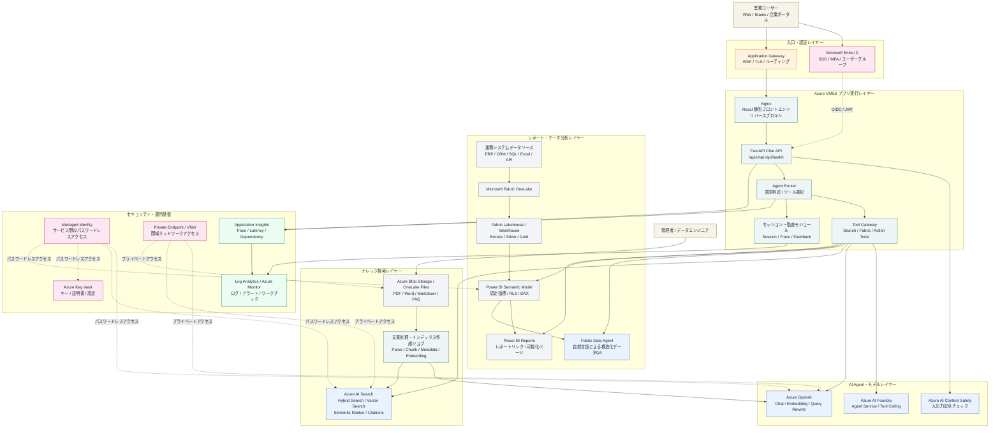
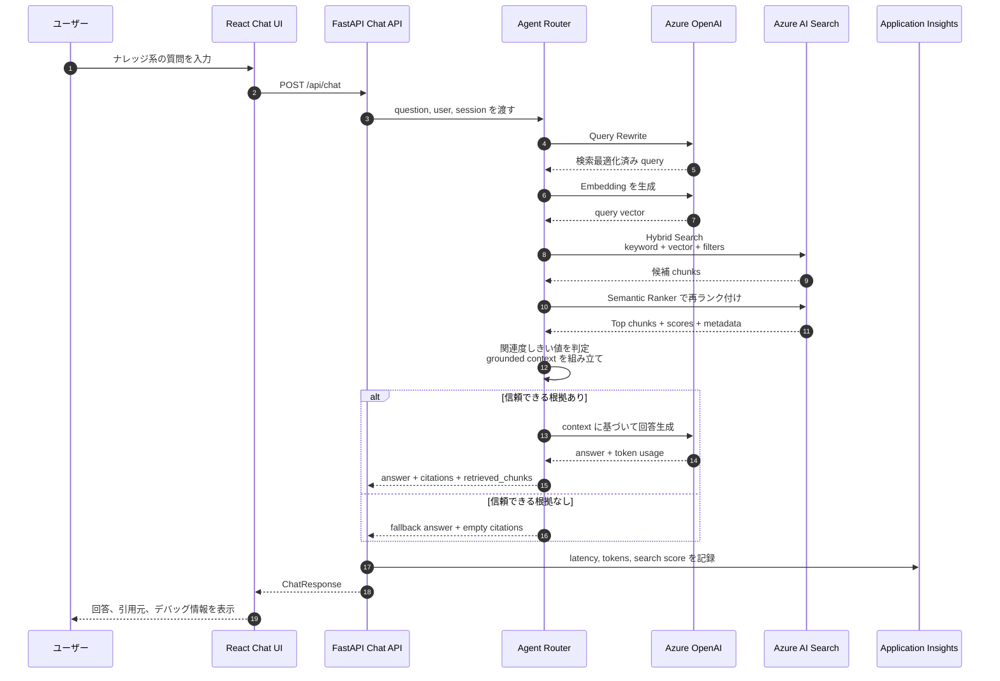
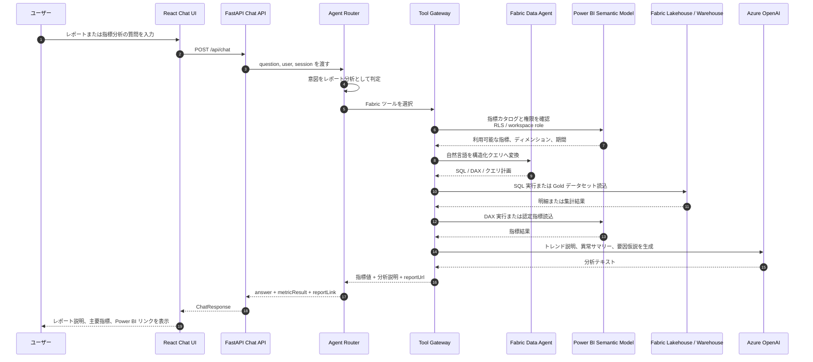

# Azure Fabric + AI Search + VM Agent Chatbot 実装アーキテクチャ図

本ドキュメントは、Microsoft Azure を基盤とした企業向け AI Agent Chatbot の実装アーキテクチャを示します。  
デプロイ方針は Azure VM / Azure VMSS を中心とし、アプリケーション実行レイヤーでは Nginx、React 静的フロントエンド、FastAPI Chat API、Agent Router、Tool Gateway を稼働させます。ナレッジ検索は Azure AI Search、レポート分析は Microsoft Fabric と Power BI Semantic Model が担当します。

## 1. 全体実装アーキテクチャ図

この図は、次の 3 つの実装上の問いに答えます。

- アプリケーションの配置先：React 静的フロントエンド、FastAPI API、Agent Router、Tool Gateway は Azure VM / Azure VMSS 上で稼働します。
- 文書ナレッジの検索方法：業務文書を Blob Storage または OneLake Files に格納し、解析、分割、ベクトル化を行ったうえで Azure AI Search に登録します。
- レポートデータの分析方法：業務データを Microsoft Fabric OneLake、Lakehouse/Warehouse、Power BI Semantic Model に集約し、Agent が Fabric Data Agent、SQL、DAX、Power BI API を呼び出して分析結果を生成します。

## 2. ナレッジ検索 / RAG フロー図

オフラインのインデックス作成フローは、制御されたバッチ処理として実行します。業務文書を Blob Storage または OneLake Files に格納し、文書解析、OCR、chunk 分割、metadata 付与、embedding 生成を行ったうえで、Azure AI Search Index に登録します。インデックスには少なくとも `content`、`content_vector`、`source`、`section`、`securityGroups` を保持し、引用表示と文書単位の権限制御を実現します。

## 3. Fabric レポート分析フロー図

Fabric へのデータ取り込みは、標準的なレイクハウス分層で設計します。業務システムのデータを Fabric Data Factory、Pipeline、Mirroring のいずれかで OneLake に取り込み、Bronze、Silver、Gold の各層で整備します。その後、Power BI Semantic Model に公開し、Chatbot は認定指標、レポートリンク、権限制御済みのクエリ結果のみを参照します。

## 4. 実装境界とデフォルト方針

- VM / VMSS はアプリケーション実行基盤として利用し、大規模モデルの学習や推論は行いません。モデル推論には Azure OpenAI または Azure AI Foundry を使用します。
- Azure AI Search は非構造化ナレッジ検索を担当します。インデックスには `content`、`content_vector`、`source`、`section`、`securityGroups` などの項目を保持し、引用表示と権限制御に利用します。
- Microsoft Fabric は構造化データの管理、レイクハウスモデリング、指標定義、Power BI レポートを担当します。Agent が計算式を推測するのではなく、Semantic Model 内の認定指標を優先して利用します。
- Tool Gateway は Agent のツール呼び出しを制御されたインターフェースに集約し、モデルが基盤データベース、検索インデックス、レポートサービスへ直接アクセスしないようにします。
- 本番環境では、Entra ID、Managed Identity、Key Vault、Private Endpoint、Application Insights、Log Analytics を標準で有効化します。

## 5. 受け入れ確認

- 3 つの Mermaid 図が VS Code Markdown Preview または Mermaid Preview でレンダリングできること。
- メイン経路が「ユーザー -> Application Gateway/WAF -> Azure VMSS -> FastAPI Agent Orchestrator -> Azure OpenAI/Foundry + Azure AI Search + Microsoft Fabric」として明確に表現されていること。
- 文書ナレッジ検索の経路が「Blob Storage/OneLake -> Parse -> Chunk -> Embedding -> Azure AI Search -> citations」として明確に表現されていること。
- レポート分析の経路が「Fabric OneLake -> Lakehouse/Warehouse -> Power BI Semantic Model -> Fabric Data Agent / DAX / SQL -> Chatbot の分析回答」として明確に表現されていること。
- 文書全体が UTF-8 で保存され、文字化けがないこと。
