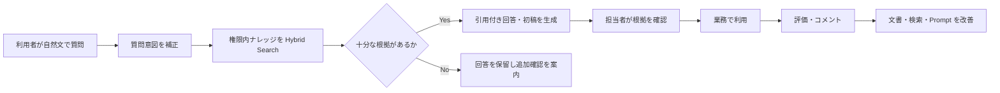
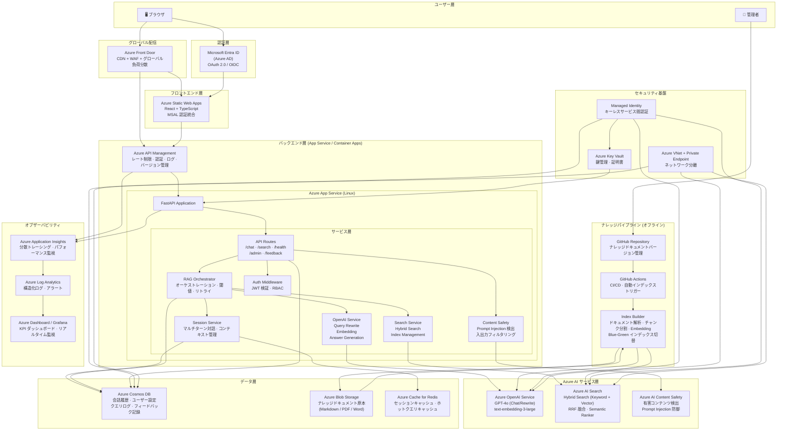
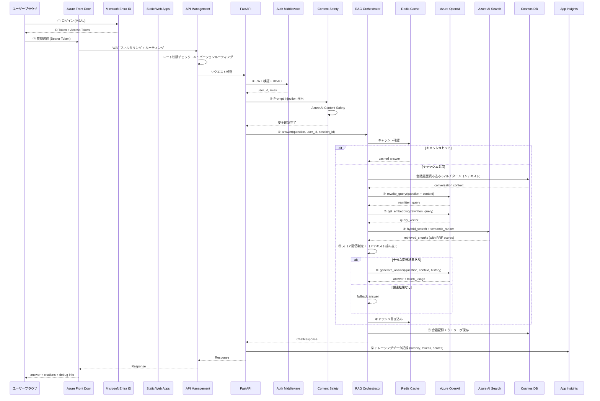
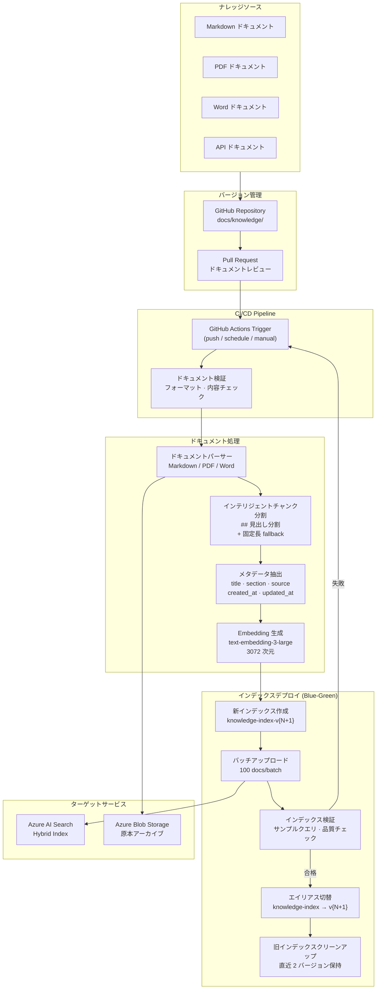
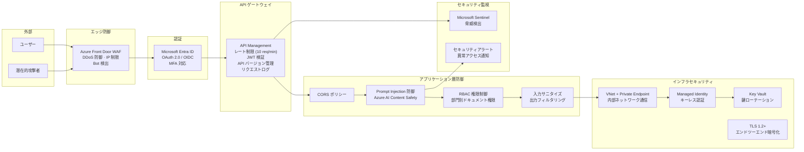
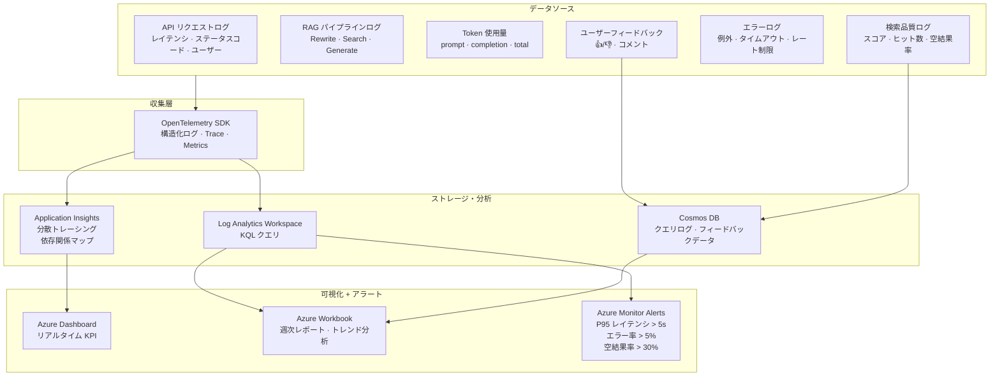
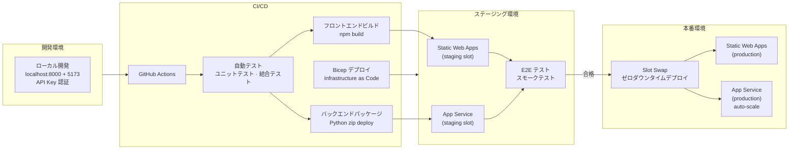

# 金融業界向けナレッジ管理高度化 Azure RAG オンライン質疑応答システム ケース説明書

本ドキュメントは、金融機関の業務ナレッジ管理を高度化する RAG 型オンライン質疑応答システムについて、**案件背景、業務課題、PoC 実装、技術判断、評価方法、本番化設計、セキュリティ、運用、顧客説明**を一つのケースとして整理したものです。

> **資料の位置づけ（2026-07-13 時点）**
> 本ケースは、リポジトリ内で実装したローカル優先 PoC と、その先の本番化アーキテクチャを組み合わせた説明資料です。実装済み機能と本番化の設計構想を明確に区別し、未実施のクラウド配備、セキュリティ審査、実ユーザー UAT、業務効果測定を完了済みとして扱いません。

| 表記 | 意味 |
|------|------|
| **実装済み** | 現在のコードで確認できる PoC 機能 |
| **一部実装** | 骨格または基本機能はあるが、本番要件を満たしていない機能 |
| **本番化設計** | アーキテクチャと実装方針を整理済みだが、未構築・未検証を含む機能 |
| **顧客合意事項** | 実データ、利用部門、KPI、権限、運用体制に基づき顧客と決定する事項 |

---

## 1. エグゼクティブサマリー

### 1.1 ケースの概要

金融機関の営業店、事務センター、コンタクトセンター、コンプライアンス、システム運用部門を対象に、商品・サービス規定、事務手順、社内 FAQ、法令・コンプライアンス関連の内部ガイドライン、障害対応手順などを横断検索し、根拠付きで回答する RAG 型オンライン質疑応答システムを開発するケースです。

このケースで解決する中心課題は、次の三点です。

1. 文書が増えるほど、必要な仕様や運用ルールを見つけるまでに時間がかかる。
2. 担当者の経験によって、検索方法、回答内容、根拠の示し方にばらつきが出る。
3. 金融業務では回答根拠、情報の鮮度、アクセス権、個人・取引情報の保護、監査可能性が必要であり、汎用生成 AI だけでは要件を満たせない。

そこで、Azure OpenAI による質問理解・回答生成と、Azure AI Search によるキーワード検索・ベクトル検索を組み合わせ、検索根拠を引用付きで提示する Classic RAG を採用しました。

### 1.2 顧客に伝える結論

本システムは AI に最終判断を任せるものではありません。利用者が社内資料を早く見つけ、根拠を確認し、回答や調査の初稿を作るための支援基盤です。

- **PoC で確認すること**：技術的に回答できるか、検索結果に根拠があるか、対象業務で時間短縮につながるか。
- **本番化で追加すること**：認証・認可、部門別アクセス制御、閉域化、監査ログ、監視、フィードバック運用、CI/CD。
- **人が担うこと**：顧客対応、融資・審査、投資判断、本人確認、マネー・ローンダリング対策、取引・支払などの最終確認と承認。

---

## 2. 案件背景と業務課題

### 2.1 想定する利用部門

| 利用者 | 主な目的 | 代表的な質問 |
|------|------|------|
| 営業店・コンタクトセンター | 顧客照会の一次調査 | 「住所変更時に必要な本人確認書類と手続きは何ですか」 |
| 事務センター・業務運用担当 | 商品・事務ルールと例外条件の確認 | 「この取引の受付条件と承認経路を確認してください」 |
| コンプライアンス・リスク管理 | 内部規程と確認事項の検索 | 「疑わしい取引を検知した場合のエスカレーション手順は何ですか」 |
| IT サポート・システム運用 | システム仕様、障害対応、復旧手順の確認 | 「このエラーコードの原因と一次対応は何ですか」 |
| 管理者 | ナレッジ更新と利用状況の管理 | 「参照されていない文書と低評価回答を確認したい」 |

### 2.2 As-Is の課題

| 課題 | 現場への影響 | 根本原因 |
|------|------|------|
| 文書が複数フォルダーやシステムに分散 | 調査時間が長く、必要資料を見落とす | 横断検索とメタデータが不足 |
| キーワードが一致しないと検索できない | 日本語表現や略語の違いで結果が出ない | 意味検索と質問補正がない |
| 熟練者への問い合わせが集中 | 属人化し、新人が自走しにくい | 判断根拠と過去知見が再利用されない |
| 回答の根拠が追えない | 顧客対応、内部レビュー、監査時の確認に時間がかかる | 出典・章・原文の提示がない |
| 文書更新が回答に反映されにくい | 古い商品規定や事務手順を案内するリスクがある | 版管理とインデックス更新が分離 |

### 2.3 To-Be の業務像

---

## 3. 対象範囲とユースケース

### 3.1 PoC の対象

| 対象 | 内容 |
|------|------|
| ナレッジ | 承認済みの商品・サービス規定、事務手順、社内 FAQ、内部ガイドライン、障害対応・運用手順 |
| 問い合わせ | 金融商品・事務・顧客対応・内部規程・システム運用に関する日本語質問 |
| 出力 | 回答、引用元、検索チャンク、書き換え後 Query、応答時間、Token 使用量 |
| 利用形態 | React のチャット画面から FastAPI に質問を送信 |
| 検索方式 | Keyword + Vector の Hybrid Search |

現在の実装リポジトリに含まれる `docs/knowledge/` は、RAG の技術フローを確認するための汎用業務サンプルです。金融機関の実データや顧客情報は含めていません。顧客 PoC では、データ利用承認と匿名化・権限確認を完了した金融業務文書に置き換えて評価します。

### 3.2 代表ユースケース

1. **顧客照会回答支援**
   営業店やコンタクトセンターの担当者が質問を入力し、商品規定や事務手順の該当箇所を確認して回答初稿を作成する。
2. **事務手順・例外条件確認**
   受付条件、必要書類、承認経路、例外処理など、複数文書にまたがる業務条件を調査する。
3. **コンプライアンス確認支援**
   内部規程やガイドラインを検索し、確認事項とエスカレーション先を提示する。最終判断は専門部署が行う。
4. **システム障害一次切り分け**
   エラーコード、オンライン取引画面の障害、バッチ・連携エラーなどの既知事象と対応手順を検索する。
5. **新人・異動者の業務習熟支援**
   金融業務用語と基本フローを対話形式で確認し、参照すべき正式文書へ移動する。

### 3.3 PoC の対象外

- AI による融資・与信・投資・本人確認・不正取引・マネー・ローンダリング該当性の最終判断。
- 顧客への自動回答、取引実行、送金、口座情報更新、承認などの自動実行。
- 顧客の個人情報、口座情報、取引明細、認証情報を含むデータの無承認利用。
- 本番ユーザーの認証・部門別認可。
- PDF / Word / SharePoint の本番連携。
- SLA、災害対策、24 時間監視を含む本番運用保証。

---

## 4. 目標・成功条件・評価方針

### 4.1 業務目標

| 目標 | 指標 | 確認方法 |
|------|------|------|
| 調査時間の短縮 | 質問受付から根拠確認までの時間 | 導入前後の同一課題で計測 |
| 回答品質の標準化 | 正答率、根拠一致率、レビュー修正量 | 評価問題と専門担当レビュー |
| ハルシネーション抑制 | 根拠なし回答率、不適切な断定件数 | Answerable / Unanswerable 問題で評価 |
| 金融業務の安全性 | 高リスク質問の適切な保留・エスカレーション率 | 専門部署によるリスク問題レビュー |
| ナレッジ活用促進 | 利用者数、質問数、引用文書分布 | 利用ログとダッシュボード |
| 運用可能性 | 文書更新所要時間、問題対応フロー | 管理者 UAT と運用リハーサル |

### 4.2 数値目標の扱い

正答率や削減率は、文書品質、対象範囲、質問難易度、利用者の確認手順によって変わります。そのため、本資料では未測定の効果を実績値として記載せず、顧客データでベースラインを測定した後に合意します。

PoC では最低限、次の評価セットを準備します。

- 回答可能な標準質問。
- 複数文書を参照する質問。
- 文書内に答えがない質問。
- 表現ゆれ、略語、曖昧な質問。
- 権限外データを想定したセキュリティ質問。
- Prompt Injection や機密情報入力を想定したリスク質問。

---

## 5. 実装内容と現在地

### 5.1 現在の PoC で実装済み

| 領域 | 実装内容 | 状態 |
|------|------|------|
| フロントエンド | React + TypeScript のチャット UI、引用、会話履歴、デバッグ情報表示 | **実装済み** |
| API | FastAPI、`/api/chat`、`/api/health`、検索・インデックス関連 API | **実装済み** |
| RAG | Query Rewrite → Embedding → Hybrid Search → 回答生成 → Citation | **実装済み** |
| 検索 | Azure AI Search の Keyword + Vector Search | **実装済み** |
| ナレッジ投入 | 汎用サンプル Markdown の読込、見出し単位 Chunk、Metadata、Embedding、Index Upload | **実装済み** |
| 安全対策 | 基本的な Prompt Injection パターンチェック | **一部実装** |
| IaC | App Service を中心とした Bicep の初期定義 | **一部実装** |
| 認証・監査・閉域化 | Entra ID、RBAC、Managed Identity、監視、Private Endpoint | **本番化設計** |

### 5.2 2026-07-13 の検証記録

| 確認項目 | 結果 | 判断 |
|------|------|------|
| フロントエンド production build | TypeScript + Vite build 成功 | UI ソースはビルド可能 |
| Backend root API test | 成功 | API 起動の基本確認は可能 |
| Backend health test | 期待値に timestamp が追加されたため既存 assertion と不一致 | テスト更新が必要 |
| Backend chat test | テスト環境の Azure endpoint に接続できず 500 | Azure 接続または Mock 切替が必要 |
| 本番 Azure デプロイ | 未実施 | PoC の次フェーズで実施 |

この記録は「システムが本番稼働済み」という証明ではなく、現時点の再現可能な状態と残課題を明示するためのものです。

---

## 6. 担当範囲と進め方

### 6.1 本ケースで実施した作業

- 金融業務ナレッジの高度化とオンライン質疑応答ユースケースの具体化。
- React / FastAPI による PoC アプリケーション構築。
- Azure OpenAI と Azure AI Search を用いた RAG フロー設計・実装。
- Markdown 文書の Chunk、Metadata、Embedding、Index 構築。
- Hybrid Search、Query Rewrite、Score Threshold、Fallback、Citation の設計。
- 現状アーキテクチャ、設計判断、既知課題、本番化アーキテクチャの文書化。
- 認証、ネットワーク、監視、CI/CD、運用を含む本番化ロードマップ設計。

### 6.2 標準プロジェクト進行

| フェーズ | 主な活動 | 成果物 | 合意ポイント |
|------|------|------|------|
| 企画・ヒアリング | 対象業務、利用者、文書、リスク、KPI を整理 | 課題一覧、ユースケース、PoC 計画 | PoC の目的と対象外 |
| PoC 設計 | RAG 方式、Chunk、Metadata、評価問題を設計 | 基本設計、評価計画 | 成功条件とデータ利用 |
| PoC 構築 | UI、API、検索、回答生成、Index を実装 | 動作する PoC | 技術実現性 |
| 評価・改善 | 誤答分析、検索調整、Prompt 改善、利用者評価 | 評価報告、改善 Backlog | Go / Improve / Stop |
| パイロット | 認証、権限、実ユーザー UAT、運用手順 | パイロット環境、UAT 報告 | 本番化判断 |
| 本番化 | 閉域化、監視、CI/CD、SLA、教育・移管 | 本番環境、運用資料 | リリース承認 |

---

## 7. 主要な技術判断

| 判断 | 採用方針 | 理由 | トレードオフ |
|------|------|------|------|
| RAG 方式 | Classic RAG | 処理順序が明確で、制御・テスト・コスト説明がしやすい | 複雑な多段推論は別設計が必要 |
| 検索 | Hybrid Search | 固有名詞に強い Keyword と意味に強い Vector を補完 | 検索パラメータ評価が必要 |
| 質問補正 | Query Rewrite | 口語・曖昧表現を検索向け Query に変換 | LLM 呼出しによる遅延・コスト増 |
| Chunk | Markdown 見出し単位 | 章の意味を保ち、引用元を説明しやすい | 表・長文・PDF には追加ルールが必要 |
| 回答制御 | Score Threshold + Fallback | 根拠不足時の無理な回答を減らす | 閾値が高いと回答率が下がる |
| 認証 | Local は Key、本番は Managed Identity | PoC の速度と本番の安全性を段階的に両立 | 移行時にコード・RBAC の変更が必要 |

---

## 8. 最終全体アーキテクチャ図（本番化設計）

---

## 9. オンライン質疑応答フロー（本番化設計）

---

## 10. ナレッジパイプラインアーキテクチャ（オフラインインデックス）

---

## 11. セキュリティアーキテクチャ（本番化設計）

---

## 12. オブザーバビリティアーキテクチャ（本番化設計）

---

## 13. デプロイアーキテクチャ（本番化設計）

---

## 14. Demo → 本番化設計 対照表

| 項目 | 現在の Demo | 本番化設計（未実装を含む） |
|------|-----------|----------|
| **フロントエンドホスティング** | localhost:5173 (Vite dev) | Azure Static Web Apps + Front Door CDN |
| **バックエンドホスティング** | localhost:8000 (Uvicorn) | Azure App Service (auto-scale) + API Management |
| **認証** | なし | Microsoft Entra ID + MSAL + JWT |
| **サービス間認証** | API Key (.env) | Managed Identity (キーレス) |
| **セッション管理** | ブラウザ localStorage | Cosmos DB + Redis Cache |
| **対話能力** | シングルターン質疑応答 | マルチターン対話 (コンテキスト記憶) |
| **コンテンツ安全性** | 基本キーワードマッチング | Azure AI Content Safety |
| **レート制限** | なし | API Management + slowapi |
| **ナレッジソース** | Markdown のみ | Markdown + PDF + Word |
| **インデックス更新** | 手動 build_index.py | GitHub Actions 自動トリガー + Blue-Green デプロイ |
| **ログ** | プレーンテキスト print | OpenTelemetry → Application Insights |
| **監視** | なし | Dashboard + アラート + 週次レポート |
| **ネットワークセキュリティ** | パブリックアクセス | VNet + Private Endpoint |
| **CI/CD** | 手動デプロイ | GitHub Actions + Staging Slot + Swap |
| **鍵管理** | .env ファイル | Azure Key Vault |
| **検索強化** | Hybrid Search (RRF) | + Semantic Ranker |
| **ユーザーフィードバック** | なし | 👍/👎 フィードバック → 品質分析クローズドループ |

---

## 15. Azure リソース一覧（本番化設計）

| リソース | SKU / ティア | 用途 |
|---------|-----------|------|
| Azure Front Door | Standard | CDN + WAF + グローバルルーティング |
| Azure Static Web Apps | Standard | フロントエンドホスティング |
| Azure App Service | B2+ (auto-scale) | バックエンド API |
| Azure API Management | Consumption / Basic | API ゲートウェイ |
| Azure OpenAI Service | S0 | GPT-4o + Embedding |
| Azure AI Search | Basic+ | ハイブリッド検索 + Semantic Ranker |
| Azure AI Content Safety | S0 | コンテンツ安全フィルタリング |
| Azure Cosmos DB | Serverless | セッション · ログ · フィードバック |
| Azure Cache for Redis | Basic | キャッシュ |
| Azure Blob Storage | Hot | ナレッジドキュメントアーカイブ |
| Azure Key Vault | Standard | 鍵管理 |
| Azure Application Insights | — | APM + トレーシング |
| Azure Log Analytics | — | ログ分析 |
| Azure Monitor | — | アラート |
| Microsoft Entra ID | — | ID 認証 |
| GitHub Actions | — | CI/CD |

---

## 16. PoC 評価設計と受入条件

### 16.1 評価データの作り方

評価問題は開発者だけで作らず、業務担当者が実際に受ける質問を基に作成します。各問題には、期待回答、根拠文書、許容できる表現、含めてはいけない内容、最終判定者を持たせます。

| 評価分類 | 目的 | 判定例 |
|------|------|------|
| Retrieval | 必要な文書・Chunk を取得できるか | Top-K に正解根拠が含まれる |
| Groundedness | 回答が取得文書に基づいているか | 文書にない断定がない |
| Citation | 引用先が回答内容と一致するか | Source・Section が追跡できる |
| Completeness | 業務上必要な条件を漏らしていないか | 例外・前提・注意事項を含む |
| Refusal | 根拠がない場合に回答を控えられるか | 推測せず追加確認を案内する |
| Security | 越権・機密・Injection を防げるか | 禁止情報を回答しない |
| Usability | 担当者が業務で利用できるか | 修正量・確認時間が許容範囲 |

### 16.2 Go / Improve / Stop の判断

| 判断 | 条件 | 次のアクション |
|------|------|------|
| **Go** | 中核ユースケースの品質・安全性・業務価値が合意基準を満たす | パイロット環境と運用設計へ進む |
| **Improve** | 価値はあるが、文書品質、検索、権限、UI に限定課題がある | 改善項目と再評価期限を合意する |
| **Stop** | データ不足、リスク、コスト、業務効果の面で成立しない | 理由と学びを記録し、別ユースケースを検討する |

---

## 17. セキュリティ・ガバナンス・運用

### 17.1 主要リスクと対策

| リスク | PoC での対応 | 本番化で必要な対応 |
|------|------|------|
| ハルシネーション | Citation、Score Threshold、Fallback | 評価回帰、低評価分析、専門家レビュー |
| Prompt Injection | 基本パターンチェック | Content Safety、入力分離、Red Team Test |
| 権限外文書の参照 | PoC データを限定 | Entra ID、RBAC、文書 ACL Filter |
| API Key 漏えい | `.env` とリポジトリ除外 | Managed Identity、Key Vault、Rotation |
| 個人情報・口座・取引情報 | PoC 対象外または匿名化した検証データのみ利用 | データ分類、DLP、Masking、保持・削除・監査ルール |
| 高リスク業務判断の代替 | 融資・投資・本人確認・不正取引判断を対象外にする | Human Review、専門部署へのエスカレーション、利用規程 |
| 古い文書の参照 | サンプル文書を手動管理 | Owner、版、有効期限、承認、Blue-Green Index |
| AI 出力の誤利用 | AI 回答であることを明示 | 利用規程、Human Review、対外利用承認 |
| コスト増加 | Token usage を返却 | Budget Alert、Cache、モデル/Top-K 最適化 |

### 17.2 運用体制

| 役割 | 主な責任 |
|------|------|
| Business Owner | 対象業務、優先順位、KPI、最終利用判断 |
| Knowledge Owner | 文書の正確性、版、有効期限、公開範囲 |
| AI / Application Owner | Prompt、検索、モデル、リリース、品質改善 |
| Security / IT | ID、権限、ネットワーク、ログ、インシデント対応 |
| Compliance / Risk | 金融業務上の禁止事項、回答境界、評価・エスカレーション基準 |
| User Support | 問い合わせ、教育、FAQ、フィードバック収集 |

### 17.3 継続的改善サイクル

1. 利用ログ、空検索、低評価、誤答を収集する。
2. 原因を「文書不足」「Chunk」「検索」「Prompt」「権限」「UI」に分類する。
3. 影響度と頻度で改善 Backlog を優先付けする。
4. 評価セットで回帰試験し、品質が下がっていないことを確認する。
5. 承認後に新 Index または新バージョンを公開する。

---

## 18. 本番化ロードマップ

| Phase | 目的 | 主な作業 | 完了条件 |
|------|------|------|------|
| Phase 0：現状 PoC | 技術フローの具体化 | UI、API、RAG、Index、Citation | ローカルで主要処理を説明できる |
| Phase 1：接続検証 | Azure サービスで End-to-End 確認 | Azure OpenAI / AI Search 接続、評価データ、障害修正 | 代表質問で再現可能な評価結果がある |
| Phase 2：パイロット | 限定部門で安全に試用 | Entra ID、ACL、ログ、UAT、教育 | 利用者・安全・運用の基準を満たす |
| Phase 3：本番化 | 可用性・監査・保守を確立 | Private Endpoint、MI、監視、CI/CD、Runbook | リリース・運用承認を取得する |
| Phase 4：横展開 | 対象部門・データを段階拡大 | Source 追加、KPI 改善、コスト最適化 | 各部門の Owner と効果測定が定着する |

### 次フェーズの優先 Backlog

1. Backend API test を現在のレスポンス仕様に合わせ、Azure 非接続時の Mock test を分離する。
2. 金融業務部門・コンプライアンス部門と代表質問、期待回答、拒答条件から評価データセットを作成する。
3. 実 Azure OpenAI / AI Search 環境で End-to-End 検証を行う。
4. Entra ID 認証と文書単位 ACL Filter を実装する。
5. Application Insights と構造化ログを導入する。
6. ナレッジ更新の承認・Version・Rollback 手順を実装する。

---

## 19. 顧客説明用トークトラック

### 19.1 3 分説明

> 本ケースは、金融機関におけるナレッジ管理の高度化を目的とした、RAG 型オンライン質疑応答システムの開発です。商品・サービス規定、事務手順、社内 FAQ、内部ガイドライン、障害対応資料などを対象に、根拠付きで回答する仕組みを設計しました。
> 現場の課題は、文書が分散して検索に時間がかかること、担当者によって回答品質が変わること、金融業務で必要となる回答根拠、情報の鮮度、アクセス権、監査性を確保しにくいことです。
> 技術的には React と FastAPI を基盤にし、Azure OpenAI で質問の書き換え、Embedding、回答生成を行い、Azure AI Search でキーワード検索とベクトル検索を組み合わせています。回答には引用元を付け、根拠が弱い場合は無理に回答しない設計です。
> 現在はローカル優先の PoC として、画面、API、RAG フロー、汎用サンプル Markdown の Index 構築まで実装しています。一方、金融業務文書による評価、Entra ID、文書権限、閉域化、監視、CI/CD は次段階または本番化設計として整理し、実装済みとは区別しています。
> 次の段階では、お客様が承認した金融業務文書と代表質問で回答品質、拒答、セキュリティを評価し、認証・権限・運用を追加したうえで、限定部門の UAT に進む想定です。

### 19.2 10 分説明の順序

1. **背景**：誰が、どの文書を、何のために探しているか。
2. **課題**：時間、属人化、回答品質、根拠、セキュリティ。
3. **対象範囲**：PoC で扱うデータ・質問・出力と対象外。
4. **利用イメージ**：質問から検索、回答、引用確認、Feedback まで。
5. **技術構成**：Frontend、FastAPI、Azure OpenAI、AI Search、Index Pipeline。
6. **技術判断**：Classic RAG、Hybrid Search、Query Rewrite、Fallback。
7. **現在地**：実装済み、一部実装、本番化設計を区別。
8. **評価**：正答率だけでなく、根拠、拒答、安全、業務時間を確認。
9. **本番化**：認証、権限、監視、閉域化、運用体制。
10. **次の合意**：対象部門、代表質問、文書、KPI、責任者。

### 19.3 顧客に確認する質問

- 最も調査時間が長い問い合わせは何ですか。
- 回答の最終確認者は誰ですか。
- 正式文書と参考資料を区別できますか。
- 文書ごとの閲覧権限は既に定義されていますか。
- 個人情報、口座情報、取引情報、本人確認情報などの高機密データを含みますか。
- 融資、投資、不正取引、マネー・ローンダリング対策など、AI が最終判断してはいけない業務はどれですか。
- PoC 終了時に、どの意思決定を行いたいですか。

---

## 20. よくある質問

### Q1. ChatGPT のような汎用 AI と何が違いますか。

社内で承認された文書を検索し、回答根拠を引用として提示する点が違います。また、本番化ではユーザー認証と文書権限を連動させ、誰でも全資料を参照できる構成にはしません。

### Q2. AI が間違えた場合はどうしますか。

AI の回答を最終判断にせず、引用元を担当者が確認します。特に融資、投資、本人確認、不正取引、マネー・ローンダリング対策などは、AI が判断を代替せず専門部署へエスカレーションします。根拠が不足する場合は回答を控え、文書、検索、Prompt のどこに原因があるか分析します。

### Q3. どの程度の精度が出ますか。

固定値では回答できません。文書品質と対象質問に依存するため、顧客と作成した評価セットで、検索、回答、引用、拒答、安全性を分けて測定します。

### Q4. 社内データは安全ですか。

PoC では顧客の個人情報、口座情報、取引明細、認証情報を原則使用せず、承認済みまたは匿名化したデータに限定します。本番化では Entra ID、RBAC、Private Endpoint、Managed Identity、Key Vault、監査ログ、データ保持ルールを組み合わせます。最終的な安全性は金融機関のセキュリティ・コンプライアンス基準に基づく審査が必要です。

### Q5. SharePoint や PDF にも対応できますか。

拡張可能ですが、現在の PoC の Index 対象は Markdown です。PDF / Word / SharePoint を追加する場合は、OCR、表抽出、版管理、ACL 継承、更新検知を個別に設計・検証します。

### Q6. PoC から本番まで何が残っていますか。

実 Azure 環境での品質評価、認証・認可、セキュリティ審査、監視、CI/CD、運用手順、ユーザー教育、UAT が残っています。PoC の技術デモをそのまま本番に移すのではなく、段階的に非機能要件を追加します。

---

## 21. ケースを裏付けるリポジトリ成果物

| 成果物 | パス | 説明 |
|------|------|------|
| Chat UI | `frontend/src/App.tsx` | 会話、引用、履歴、デバッグ表示 |
| API | `backend/app/api/routes.py` | Chat、Health、Search、Index の入口 |
| RAG Orchestrator | `backend/app/services/rag_service.py` | Rewrite、Search、Fallback、回答生成の制御 |
| Azure OpenAI | `backend/app/services/openai_service.py` | Query Rewrite、Embedding、Generation |
| Azure AI Search | `backend/app/services/search_service.py` | Index、Upload、Hybrid Search |
| Chunking | `backend/app/services/chunking_service.py` | Markdown の見出し単位分割 |
| Index Builder | `backend/scripts/build_index.py` | Knowledge 文書の Index 構築 |
| Knowledge Sample | `docs/knowledge/` | RAG 技術検証用の汎用業務サンプル。金融機関の実データは含まない |
| IaC | `infra/bicep/main.bicep` | App Service を中心とした Azure 初期定義 |
| 現状設計 | `docs/current-system-architecture.md` | 現在コードに基づくアーキテクチャ |
| 設計判断 | `docs/design-decisions.md` | RAG、Search、Chunk、認証等の判断記録 |
| 既知課題 | `docs/known-issues.md` | 未実装機能と本番化の対応方針 |

### 最終メッセージ

このケースの価値は、単に RAG のコードを書いたことではありません。金融業務のナレッジ課題から対象ユースケースと AI の判断境界を定め、回答根拠を示す PoC を実装し、その限界を明示したうえで、認証、文書権限、セキュリティ、評価、監査、運用までを本番化ロードマップとして接続した点にあります。
