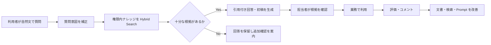
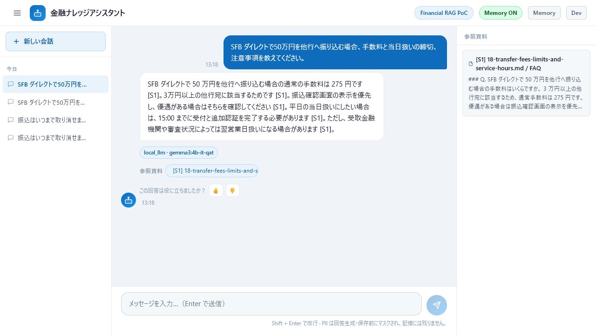
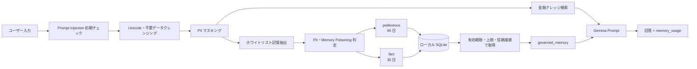
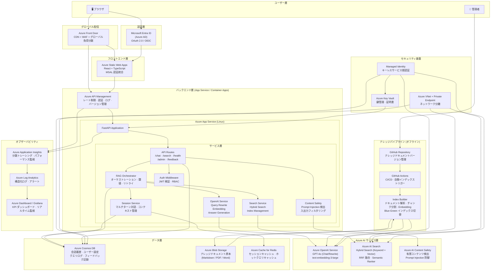
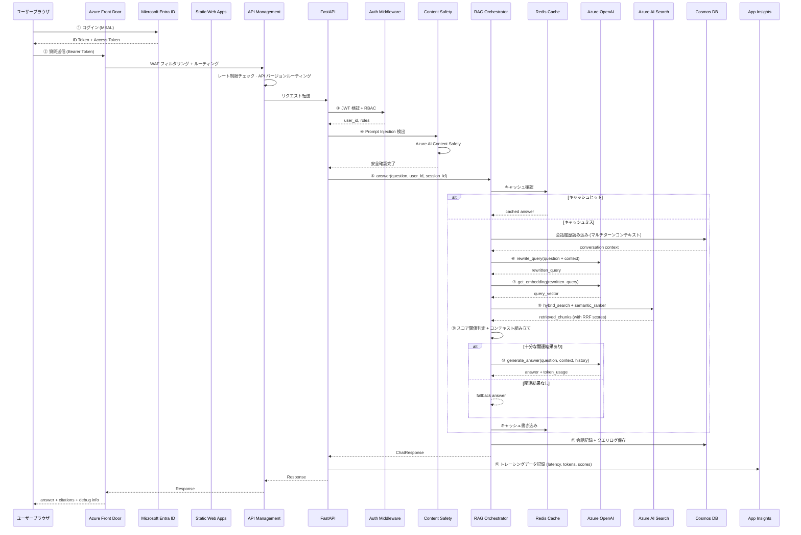
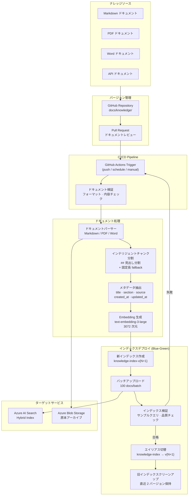
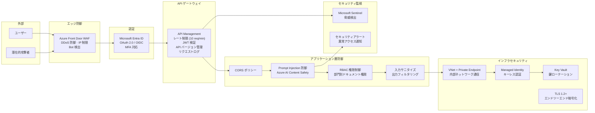
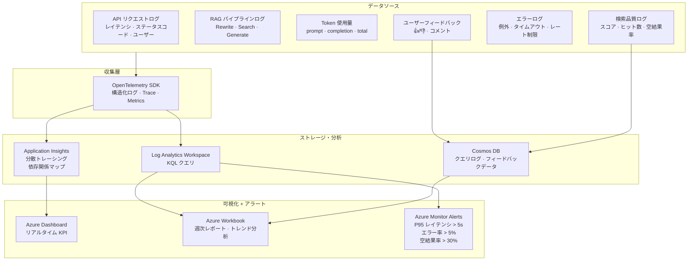
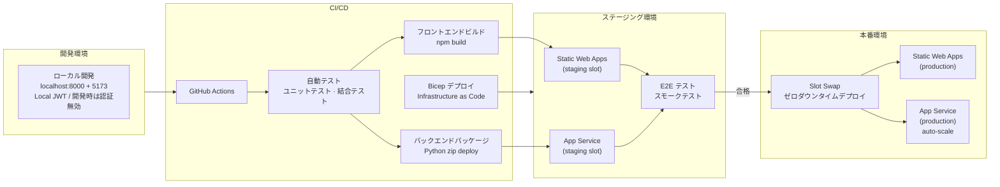

# 金融業界向けナレッジ管理高度化 Azure RAG オンライン質疑応答システム ケース説明書

本ドキュメントは、金融機関の業務ナレッジ管理を高度化する RAG 型オンライン質疑応答システムについて、**案件背景、業務課題、PoC 実装、技術判断、評価方法、本番化設計、セキュリティ、運用、顧客説明**を一つのケースとして整理したものです。

> **資料の位置づけ（2026-07-14 時点）**
> 本ケースは、リポジトリ内で実装したローカル優先 PoC と、その先の本番化アーキテクチャを組み合わせた説明資料です。実装済み機能と本番化の設計構想を明確に区別し、未実施のクラウド配備、セキュリティ審査、実ユーザー UAT、業務効果測定を完了済みとして扱いません。

| 表記             | 意味                                                              |
| ---------------- | ----------------------------------------------------------------- |
| **実装済み**     | 現在のコードで確認できる PoC 機能                                 |
| **一部実装**     | 骨格または基本機能はあるが、本番要件を満たしていない機能          |
| **本番化設計**   | アーキテクチャと実装方針を整理済みだが、未構築・未検証を含む機能  |
| **顧客合意事項** | 実データ、利用部門、KPI、権限、運用体制に基づき顧客と決定する事項 |

---

## 1. エグゼクティブサマリー

### 1.1 ケースの概要

金融機関の営業店、事務センター、コンタクトセンター、コンプライアンス、システム運用部門を対象に、商品・サービス規定、事務手順、社内 FAQ、法令・コンプライアンス関連の内部ガイドライン、障害対応手順などを横断検索し、根拠付きで回答する RAG 型オンライン質疑応答システムを開発するケースです。

このケースで解決する中心課題は、次の三点です。

1. 文書が増えるほど、必要な仕様や運用ルールを見つけるまでに時間がかかる。
2. 担当者の経験によって、検索方法、回答内容、根拠の示し方にばらつきが出る。
3. 金融業務では回答根拠、情報の鮮度、アクセス権、個人・取引情報の保護、監査可能性が必要であり、汎用生成 AI だけでは要件を満たせない。

そこで、Azure OpenAI による質問理解・回答生成と、Azure AI Search によるキーワード検索・ベクトル検索を組み合わせ、検索根拠を引用付きで提示する Classic RAG を採用しました。

### 1.2 顧客に伝える結論

本システムは AI に最終判断を任せるものではありません。利用者が社内資料を早く見つけ、根拠を確認し、回答や調査の初稿を作るための支援基盤です。

- **PoC で確認すること**：技術的に回答できるか、検索結果に根拠があるか、対象業務で時間短縮につながるか。ローカル環境では JWT 認証、役割制御、文書 ACL、構造化ログ、メトリクス、フィードバック、CI まで技術検証済みです。
- **本番化で追加・検証すること**：Entra ID、Azure RBAC、Managed Identity、Key Vault、閉域化、クラウド監視、デプロイ自動化、セキュリティ審査、実ユーザー UAT。
- **人が担うこと**：顧客対応、融資・審査、投資判断、本人確認、マネー・ローンダリング対策、取引・支払などの最終確認と承認。

---

## 2. 案件背景と業務課題

### 2.1 想定する利用部門

| 利用者                       | 主な目的                               | 代表的な質問                                                   |
| ---------------------------- | -------------------------------------- | -------------------------------------------------------------- |
| 営業店・コンタクトセンター   | 顧客照会の一次調査                     | 「住所変更時に必要な本人確認書類と手続きは何ですか」           |
| 事務センター・業務運用担当   | 商品・事務ルールと例外条件の確認       | 「この取引の受付条件と承認経路を確認してください」             |
| コンプライアンス・リスク管理 | 内部規程と確認事項の検索               | 「疑わしい取引を検知した場合のエスカレーション手順は何ですか」 |
| IT サポート・システム運用    | システム仕様、障害対応、復旧手順の確認 | 「このエラーコードの原因と一次対応は何ですか」                 |
| 管理者                       | ナレッジ更新と利用状況の管理           | 「参照されていない文書と低評価回答を確認したい」               |

### 2.2 As-Is の課題

| 課題                                 | 現場への影響                                       | 根本原因                           |
| ------------------------------------ | -------------------------------------------------- | ---------------------------------- |
| 文書が複数フォルダーやシステムに分散 | 調査時間が長く、必要資料を見落とす                 | 横断検索とメタデータが不足         |
| キーワードが一致しないと検索できない | 日本語表現や略語の違いで結果が出ない               | 意味検索と質問補正がない           |
| 熟練者への問い合わせが集中           | 属人化し、新人が自走しにくい                       | 判断根拠と過去知見が再利用されない |
| 回答の根拠が追えない                 | 顧客対応、内部レビュー、監査時の確認に時間がかかる | 出典・章・原文の提示がない         |
| 文書更新が回答に反映されにくい       | 古い商品規定や事務手順を案内するリスクがある       | 版管理とインデックス更新が分離     |

### 2.3 To-Be の業務像

---

## 3. 対象範囲とユースケース

### 3.1 PoC の対象

| 対象       | 内容                                                                                   |
| ---------- | -------------------------------------------------------------------------------------- |
| ナレッジ   | 承認済みの商品・サービス規定、事務手順、社内 FAQ、内部ガイドライン、障害対応・運用手順 |
| 問い合わせ | 金融商品・事務・顧客対応・内部規程・システム運用に関する日本語質問                     |
| 出力       | 回答、引用元、検索チャンク、書き換え後 Query、応答時間、Token 使用量                   |
| 利用形態   | React のチャット画面から FastAPI に質問を送信                                          |
| 検索方式   | Keyword + Vector の Hybrid Search                                                      |

現在の実装リポジトリに含まれる `docs/knowledge/` は、RAG の技術フローを確認するための汎用業務サンプルです。金融機関の実データや顧客情報は含めていません。顧客 PoC では、データ利用承認と匿名化・権限確認を完了した金融業務文書に置き換えて評価します。

### 3.2 代表ユースケース

1. **顧客照会回答支援**
   営業店やコンタクトセンターの担当者が質問を入力し、商品規定や事務手順の該当箇所を確認して回答初稿を作成する。
2. **事務手順・例外条件確認**
   受付条件、必要書類、承認経路、例外処理など、複数文書にまたがる業務条件を調査する。
3. **コンプライアンス確認支援**
   内部規程やガイドラインを検索し、確認事項とエスカレーション先を提示する。最終判断は専門部署が行う。
4. **システム障害一次切り分け**
   エラーコード、オンライン取引画面の障害、バッチ・連携エラーなどの既知事象と対応手順を検索する。
5. **新人・異動者の業務習熟支援**
   金融業務用語と基本フローを対話形式で確認し、参照すべき正式文書へ移動する。

### 3.3 PoC の対象外

- AI による融資・与信・投資・本人確認・不正取引・マネー・ローンダリング該当性の最終判断。
- 顧客への自動回答、取引実行、送金、口座情報更新、承認などの自動実行。
- 顧客の個人情報、口座情報、取引明細、認証情報を含むデータの無承認利用。
- 本番ユーザーの認証・部門別認可。
- PDF / Word / SharePoint の本番連携。
- SLA、災害対策、24 時間監視を含む本番運用保証。

---

## 4. 目標・成功条件・評価方針

### 4.1 業務目標

| 目標                 | 指標                                         | 確認方法                             |
| -------------------- | -------------------------------------------- | ------------------------------------ |
| 調査時間の短縮       | 質問受付から根拠確認までの時間               | 導入前後の同一課題で計測             |
| 回答品質の標準化     | 正答率、根拠一致率、レビュー修正量           | 評価問題と専門担当レビュー           |
| ハルシネーション抑制 | 根拠なし回答率、不適切な断定件数             | Answerable / Unanswerable 問題で評価 |
| 金融業務の安全性     | 高リスク質問の適切な保留・エスカレーション率 | 専門部署によるリスク問題レビュー     |
| ナレッジ活用促進     | 利用者数、質問数、引用文書分布               | 利用ログとダッシュボード             |
| 運用可能性           | 文書更新所要時間、問題対応フロー             | 管理者 UAT と運用リハーサル          |

### 4.2 数値目標の扱い

正答率や削減率は、文書品質、対象範囲、質問難易度、利用者の確認手順によって変わります。そのため、本資料では未測定の効果を実績値として記載せず、顧客データでベースラインを測定した後に合意します。

PoC では最低限、次の評価セットを準備します。

- 回答可能な標準質問。
- 複数文書を参照する質問。
- 文書内に答えがない質問。
- 表現ゆれ、略語、曖昧な質問。
- 権限外データを想定したセキュリティ質問。
- Prompt Injection や機密情報入力を想定したリスク質問。

---

## 5. 実装内容と現状

### 5.1 現在の PoC で実装済み

| 領域                   | 実装内容                                                                                                    | 状態           |
| ---------------------- | ----------------------------------------------------------------------------------------------------------- | -------------- |
| フロントエンド         | React + TypeScript のチャット UI、引用、履歴、Memory ON/OFF・単一削除、回答フィードバック、レスポンシブ表示 | **実装済み**   |
| API                    | FastAPI、Chat、Health、Memory、Feedback、Metrics、検索・インデックス関連 API                                | **実装済み**   |
| RAG                    | Query Rewrite → Embedding → Hybrid Search → 回答生成 → Citation                                             | **実装済み**   |
| 検索                   | Azure AI Search の Keyword + Vector Search と、Azure 非接続時のローカル検索                                 | **実装済み**   |
| ナレッジ投入           | Markdown 読込、見出し・自然境界 Chunk、重複 ID 防止、Metadata、Embedding、Index Upload                      | **実装済み**   |
| 文書アクセス制御       | ローカル JWT の group と `access-control.json` を用いた検索前 ACL Filter                                    | **実装済み**   |
| 認証・認可             | HS256 Local JWT、`user` / `operator` / `admin`、管理 API の Role 制御、記憶所有者の `sub` 固定              | **実装済み**   |
| 会話記憶ガバナンス     | PII マスキング、preference / fact 分離、信頼度、TTL、SQLite、ON/OFF、単一・会話・全件削除                   | **実装済み**   |
| 品質フィードバック     | 👍/👎 と任意理由を PII クレンジング後に SQLite へ保存                                                       | **実装済み**   |
| 可観測性               | Request ID、JSON Log、Prometheus Metrics、任意の OpenTelemetry OTLP Export                                  | **実装済み**   |
| 開発・配布             | Backend / Frontend Docker、Docker Compose、GitHub Actions CI、Dependabot、一括検証 Script                   | **実装済み**   |
| 安全対策               | 基本的な Prompt Injection パターンチェック                                                                  | **一部実装**   |
| IaC                    | App Service を中心とした Bicep の初期定義                                                                   | **一部実装**   |
| Azure 本番セキュリティ | Entra ID、Azure RBAC、Managed Identity、Key Vault、Private Endpoint、クラウド監査                           | **本番化設計** |

### 回答画面（ローカル PoC）

_図 1. ローカル金融ナレッジを検索し、`gemma3:4b-it-qat` が手数料、当日扱いの締切、注意事項を根拠番号付きで生成した Chatbot 画面。`local_llm`、モデル名、引用資料、フィードバック導線を同一画面で確認できます。_

### 5.2 P5：会話記憶ガバナンスの設計要件（実装済み）

#### 5.2.1 目的と設計方針

P5 の目的は、会話全文を無条件に再利用することではなく、次回以降の対話に必要な情報だけを、PII と不正な指示を除去したうえで構造化して保持することです。金融業務における誤記憶、機密情報の残存、Memory Poisoning、古い情報の継続利用を抑えるため、次の方針を採用します。

- 元の会話全文およびモデル回答は、サーバー側の長期記憶として保存しない。
- 保存対象を明示的な `preference` と `fact` に限定する。
- PII マスキング後の値だけを後続処理へ渡し、PII を含む記憶候補は保存しない。
- 記憶は金融規程、商品条件、審査・取引判断の根拠として使用しない。
- 金融ナレッジ検索結果を常に会話記憶より優先し、会話記憶を Citation にしない。
- 信頼度、有効期限、保存上限、参照、削除を管理し、利用者が記憶状態を確認できるようにする。

#### 5.2.2 機能要件

| ID     | 要件             | 実装内容                                                                                              | 受入条件                                                                             |
| ------ | ---------------- | ----------------------------------------------------------------------------------------------------- | ------------------------------------------------------------------------------------ |
| MEM-01 | 利用者・会話識別 | Local JWT 有効時は Token の `sub` を所有者とし、開発用の認証無効時だけブラウザ `client_id` を使用する | クライアント指定による他利用者の記憶参照を防ぎつつ、同一利用者の別会話で再利用できる |
| MEM-02 | 入力クレンジング | NFKC 正規化、制御・ゼロ幅文字除去、HTML 除去、連続文字圧縮、2,000 文字制限を適用する                  | クリーンな `sanitized_question` が検索・生成へ渡る                                   |
| MEM-03 | PII マスキング   | メール、電話、郵便番号、明示的な口座・顧客番号、10～19 桁数字をプレースホルダーへ置換する             | 元の値が SQLite と新規ブラウザ履歴へ残らない                                         |
| MEM-04 | 記憶分類         | 回答言語・詳しさを `preference`、明示的な「覚えて」情報を `fact` として抽出する                       | 通常の質問から長期 Fact を推測しない                                                 |
| MEM-05 | 信頼度           | 言語 preference 0.90、回答スタイル 0.85、明示 Fact 0.90 を付与する                                    | UI/API で信頼度を確認できる                                                          |
| MEM-06 | Poisoning 防止   | Prompt Injection、System Prompt 抽出、指示上書き表現を含む候補を破棄する                              | 危険候補が保存されず、次回 Prompt の命令に昇格しない                                 |
| MEM-07 | 永続化           | ローカル SQLite に構造化記憶だけを Upsert する                                                        | `client_id + kind + memory_key` の重複・競合を抑止できる                             |
| MEM-08 | TTL              | preference は 90 日、fact は 30 日を既定とし、更新時に期限を更新する                                  | 期限切れ記憶が参照されず、清掃 API で削除できる                                      |
| MEM-09 | 参照上限         | preference 優先、信頼度・更新日時順で最大 12 件を取得する                                             | Prompt へ過剰な記憶を投入しない                                                      |
| MEM-10 | モデル利用境界   | 記憶を `<governed_memory>` として不信頼な補助データに分離する                                         | Fact が金融判断根拠や `[S#]` Citation にならない                                     |
| MEM-11 | ユーザー制御     | Memory ON/OFF、記憶一覧、単一・会話単位・利用者全件削除を API/UI で提供する                           | 利用者が保存・参照を止め、内容と期限を確認して必要な単位で削除できる                 |
| MEM-12 | 可観測性         | 参照数、保存数、PII 種別、破棄数を Chat 応答へ返す                                                    | 開発画面と API で今回の記憶処理を確認できる                                          |

#### 5.2.3 処理フロー

#### 5.2.4 保存対象と保存禁止対象

| 区分                             | 保存例                                   | 信頼度 | 既定 TTL | 利用目的                   |
| -------------------------------- | ---------------------------------------- | -----: | -------: | -------------------------- |
| `preference / response_language` | 日本語、英語                             |   0.90 |    90 日 | 回答言語だけを調整         |
| `preference / answer_style`      | concise、detailed                        |   0.85 |    90 日 | 回答の詳しさだけを調整     |
| `fact / explicit_<hash>`         | 「覚えておいて：所属部門はリスク管理部」 |   0.90 |    30 日 | 低リスクな利用者文脈の補助 |

保存しない情報は、元の会話全文、モデル回答、暗黙推論した属性、メール、電話、郵便番号、口座・顧客番号、長い数値列、PII プレースホルダーを含む候補、Prompt Injection、System Prompt 抽出要求です。Fact の信頼度は抽出確度を表し、内容の真実性を保証するものではありません。

#### 5.2.5 SQLite データ要件

既定の保存先は `output/memory/conversation-memory.sqlite3` です。`memory_items` には、`id`、`client_id`、`conversation_id`、`kind`、`memory_key`、`value`、`confidence`、`source`、`created_at`、`updated_at`、`expires_at`、`status` を保持します。

- `UNIQUE(client_id, kind, memory_key)` により、回答言語などの同一設定は最新値へ Upsert する。
- 有効記憶検索用に `client_id + status + expires_at` の Index を持つ。
- 期限切れデータは Chat 処理時または `POST /api/memory/cleanup` で物理削除する。
- SQLite は `.gitignore` 対象とし、リポジトリへ会話記憶を登録しない。

#### 5.2.6 API・UI 要件

| 操作         | API / UI                                               | 動作                                                                                                           |
| ------------ | ------------------------------------------------------ | -------------------------------------------------------------------------------------------------------------- |
| Chat         | `POST /api/chat`                                       | `use_memory` を受け取り、Local JWT 有効時は `sub` を所有者として `sanitized_question` と `memory_usage` を返す |
| 一覧         | `GET /api/memory?client_id=...`                        | 有効な preference / fact、信頼度、期限を返す                                                                   |
| 単一削除     | `DELETE /api/memory/items/{item_id}`                   | 本人が指定した記憶項目だけを削除する                                                                           |
| 会話単位削除 | `DELETE /api/memory?client_id=...&conversation_id=...` | 指定会話由来の記憶を削除する                                                                                   |
| 全削除       | `DELETE /api/memory?client_id=...`                     | 指定クライアントの記憶を全削除する                                                                             |
| 期限切れ清掃 | `POST /api/memory/cleanup`                             | 期限切れ記憶を物理削除する                                                                                     |
| Memory 画面  | ヘッダーの `Memory` ボタンと ON/OFF Toggle             | 種別、値、信頼度、期限の確認、単一削除、全削除を提供する                                                       |

`memory_usage` では、`context_items`、`stored_items`、`masked_pii`、`dropped_items` を返します。これにより、記憶が何件参照・更新され、どの PII がマスクされ、危険または不適切な候補が何件破棄されたかを確認できます。

#### 5.2.7 モデル利用境界

- ホワイトリスト化された言語・回答スタイル preference だけを形式指示へ変換する。
- 任意の Fact は System Prompt に昇格させず、不信頼な補助情報として扱う。
- 会話記憶と検索資料が矛盾する場合は検索資料を優先する。
- Fact を金融規程、商品条件、融資・KYC・AML・取引停止等の判断根拠にしない。
- 会話記憶には `[S#]` を割り当てず、Citation は検索資料だけに限定する。

#### 5.2.8 P5 受入条件

- PII と不要データが決定論的にクレンジングされ、元の値が記憶 DB に残らない。
- preference と明示 Fact が別種別で保存される。
- 通常会話、PII を含む候補、Memory Poisoning は長期 Fact として保存されない。
- 同じ preference は競合行を増やさず最新値へ更新される。
- TTL、最大参照件数、期限切れ清掃が動作する。
- 同一 `client_id` の別会話で有効記憶を参照できる。
- Memory ON/OFF、記憶一覧、単一・会話単位・全件削除が動作する。
- 記憶を利用しても金融ナレッジの根拠優先と Citation 制約が維持される。

#### 5.2.9 本番化に向けた残要件

ローカル PoC では `AUTH_MODE=local_jwt` の Token `sub` を記憶所有者として使用し、単一削除まで実装しています。ただし、Local JWT は Entra ID の代替となる本番認証ではなく、SQLite も未暗号化です。本番化では、Entra ID への置換、保存時暗号化、Key Vault、Azure RBAC、監査ログ、保持・削除証跡、本人による訂正、DLP、名前・自然言語住所を含む PII 検出強化が必要です。

### 5.3 2026-07-14 の検証記録

| 確認項目            | 結果                                                            | 判断                                                                         |
| ------------------- | --------------------------------------------------------------- | ---------------------------------------------------------------------------- |
| フロントエンド      | 4 件の Vitest と TypeScript + Vite production build が成功      | Memory、Feedback、API の主要操作と build を確認済み                          |
| Backend 自動テスト  | 59 件合格                                                       | 認証、ACL、Memory、Feedback、Logging、Metrics を含む回帰確認済み             |
| 金融検索評価        | 88 / 88 合格、Hit@3 100%                                        | 26 文書・142 Chunk の固定ローカル評価セットで検索・拒答回帰を確認済み        |
| 金融生成評価        | 22 / 22 合格、主要品質指標 100%                                 | ローカル Gemma で Groundedness、Citation、数値根拠、拒答、安全入力を確認済み |
| Bicep               | Template validation 成功                                        | Azure 初期定義の構文・参照を確認済み                                         |
| Docker              | Backend / Frontend image build、Compose 起動、Health check 成功 | ローカル配布形態を再現可能                                                   |
| 本番 Azure デプロイ | 未実施                                                          | PoC の次フェーズで実施                                                       |

この記録は「システムが本番稼働済み」という証明ではなく、現時点の再現可能な状態と残課題を明示するためのものです。

---

## 6. 担当範囲と進め方

### 6.1 本ケースで実施した作業

- 金融業務ナレッジの高度化とオンライン質疑応答ユースケースの具体化。
- React / FastAPI による PoC アプリケーション構築。
- Azure OpenAI と Azure AI Search を用いた RAG フロー設計・実装。
- Markdown 文書の Chunk、Metadata、Embedding、Index 構築。
- Hybrid Search、Query Rewrite、Score Threshold、Fallback、Citation の設計。
- PII クレンジング、構造化会話記憶、TTL、ユーザー削除、モデル利用境界の設計・実装。
- 現状アーキテクチャ、設計判断、既知課題、本番化アーキテクチャの文書化。
- 認証、ネットワーク、監視、CI/CD、運用を含む本番化ロードマップ設計。

### 6.2 標準プロジェクト進行

| フェーズ         | 主な活動                                    | 成果物                           | 合意ポイント         |
| ---------------- | ------------------------------------------- | -------------------------------- | -------------------- |
| 企画・ヒアリング | 対象業務、利用者、文書、リスク、KPI を整理  | 課題一覧、ユースケース、PoC 計画 | PoC の目的と対象外   |
| PoC 設計         | RAG 方式、Chunk、Metadata、評価問題を設計   | 基本設計、評価計画               | 成功条件とデータ利用 |
| PoC 構築         | UI、API、検索、回答生成、Index を実装       | 動作する PoC                     | 技術実現性           |
| 評価・改善       | 誤答分析、検索調整、Prompt 改善、利用者評価 | 評価報告、改善 Backlog           | Go / Improve / Stop  |
| パイロット       | 認証、権限、実ユーザー UAT、運用手順        | パイロット環境、UAT 報告         | 本番化判断           |
| 本番化           | 閉域化、監視、CI/CD、SLA、教育・移管        | 本番環境、運用資料               | リリース承認         |

---

## 7. 主要な技術判断

| 判断     | 採用方針                                                                 | 理由                                                 | トレードオフ                               |
| -------- | ------------------------------------------------------------------------ | ---------------------------------------------------- | ------------------------------------------ |
| RAG 方式 | Classic RAG                                                              | 処理順序が明確で、制御・テスト・コスト説明がしやすい | 複雑な多段推論は別設計が必要               |
| 検索     | Hybrid Search                                                            | 固有名詞に強い Keyword と意味に強い Vector を補完    | 検索パラメータ評価が必要                   |
| 質問補正 | Query Rewrite                                                            | 口語・曖昧表現を検索向け Query に変換                | LLM 呼出しによる遅延・コスト増             |
| Chunk    | Markdown 見出し単位                                                      | 章の意味を保ち、引用元を説明しやすい                 | 表・長文・PDF には追加ルールが必要         |
| 回答制御 | Score Threshold + Fallback                                               | 根拠不足時の無理な回答を減らす                       | 閾値が高いと回答率が下がる                 |
| 会話記憶 | 原文保存ではなくガバナンス適用済み preference / fact                     | PII、誤記憶、Memory Poisoning の影響を限定しやすい   | 自由抽出より記憶対象の網羅率が低い         |
| 認証     | 利用者は Local JWT、本番は Entra ID。Azure サービス間は Managed Identity | Azure 不可期間も Role・所有権境界を検証できる        | Entra ID / Azure RBAC との実接続検証が必要 |

---

## 8. 最終全体アーキテクチャ図（本番化設計）

---

## 9. オンライン質疑応答フロー（本番化設計）

---

## 10. ナレッジパイプラインアーキテクチャ（オフラインインデックス）

---

## 11. セキュリティアーキテクチャ（本番化設計）

---

## 12. オブザーバビリティアーキテクチャ（本番化設計）

---

## 13. デプロイアーキテクチャ（本番化設計）

---

## 14. PoC → 本番化設計 対照表

| 項目                           | 現在の PoC                                                                    | 本番化設計（未実装を含む）                             |
| ------------------------------ | ----------------------------------------------------------------------------- | ------------------------------------------------------ |
| **フロントエンドホスティング** | localhost:5173 (Vite dev)                                                     | Azure Static Web Apps + Front Door CDN                 |
| **バックエンドホスティング**   | localhost:8000 (Uvicorn)                                                      | Azure App Service (auto-scale) + API Management        |
| **認証**                       | 任意の Local JWT（HS256）+ `user` / `operator` / `admin`                      | Microsoft Entra ID + MSAL + JWT                        |
| **サービス間認証**             | API Key (.env)                                                                | Managed Identity (キーレス)                            |
| **セッション管理**             | ブラウザ localStorage + `conversation_id`。認証時は JWT `sub` で所有者を固定  | Entra ID と連携した Cosmos DB + Redis Cache            |
| **対話能力**                   | PII クレンジング済み preference / fact を SQLite から会話横断参照             | 認証ユーザー単位の暗号化記憶、監査、単一項目訂正       |
| **記憶ガバナンス**             | PII マスク、TTL、最大 12 件、Poisoning 除外、ON/OFF、単一・会話・全件削除     | DLP、暗号化、Azure RBAC、同意、保持・削除証跡          |
| **文書アクセス制御**           | JWT group + JSON Metadata によるローカル ACL Filter                           | Entra ID group + Azure AI Search Security Filter       |
| **コンテンツ安全性**           | 基本キーワードマッチング                                                      | Azure AI Content Safety                                |
| **レート制限**                 | なし                                                                          | API Management + slowapi                               |
| **ナレッジソース**             | Markdown のみ                                                                 | Markdown + PDF + Word                                  |
| **インデックス更新**           | 手動 build_index.py                                                           | GitHub Actions 自動トリガー + Blue-Green デプロイ      |
| **ログ**                       | Request ID 付き JSON Log、Question / Body 非記録                              | OpenTelemetry → Application Insights / Log Analytics   |
| **監視**                       | `/api/metrics`、Prometheus、任意の OTLP Collector / Grafana                   | Azure Monitor Dashboard + Alert + 週次レポート         |
| **ネットワークセキュリティ**   | パブリックアクセス                                                            | VNet + Private Endpoint                                |
| **CI/CD**                      | GitHub Actions で Test / Build / Audit / Bicep / Secret Scan。Deploy は未実施 | GitHub Actions + Staging Slot + Swap                   |
| **鍵管理**                     | .env ファイル                                                                 | Azure Key Vault                                        |
| **検索強化**                   | Hybrid Search (RRF)                                                           | + Semantic Ranker                                      |
| **ユーザーフィードバック**     | 👍/👎 と任意理由を PII 除去後に SQLite 保存                                   | Feedback 集計・評価データ化 → 品質分析クローズドループ |

---

## 15. Azure リソース一覧（本番化設計）

| リソース                   | SKU / ティア        | 用途                               |
| -------------------------- | ------------------- | ---------------------------------- |
| Azure Front Door           | Standard            | CDN + WAF + グローバルルーティング |
| Azure Static Web Apps      | Standard            | フロントエンドホスティング         |
| Azure App Service          | B2+ (auto-scale)    | バックエンド API                   |
| Azure API Management       | Consumption / Basic | API ゲートウェイ                   |
| Azure OpenAI Service       | S0                  | GPT-4o + Embedding                 |
| Azure AI Search            | Basic+              | ハイブリッド検索 + Semantic Ranker |
| Azure AI Content Safety    | S0                  | コンテンツ安全フィルタリング       |
| Azure Cosmos DB            | Serverless          | セッション · ログ · フィードバック |
| Azure Cache for Redis      | Basic               | キャッシュ                         |
| Azure Blob Storage         | Hot                 | ナレッジドキュメントアーカイブ     |
| Azure Key Vault            | Standard            | 鍵管理                             |
| Azure Application Insights | —                   | APM + トレーシング                 |
| Azure Log Analytics        | —                   | ログ分析                           |
| Azure Monitor              | —                   | アラート                           |
| Microsoft Entra ID         | —                   | ID 認証                            |
| GitHub Actions             | —                   | CI/CD                              |

---

## 16. PoC 評価設計と受入条件

### 16.1 評価データの作り方

評価問題は開発者だけで作らず、業務担当者が実際に受ける質問を基に作成します。各問題には、期待回答、根拠文書、許容できる表現、含めてはいけない内容、最終判定者を持たせます。

| 評価分類     | 目的                               | 判定例                       |
| ------------ | ---------------------------------- | ---------------------------- |
| Retrieval    | 必要な文書・Chunk を取得できるか   | Top-K に正解根拠が含まれる   |
| Groundedness | 回答が取得文書に基づいているか     | 文書にない断定がない         |
| Citation     | 引用先が回答内容と一致するか       | Source・Section が追跡できる |
| Completeness | 業務上必要な条件を漏らしていないか | 例外・前提・注意事項を含む   |
| Refusal      | 根拠がない場合に回答を控えられるか | 推測せず追加確認を案内する   |
| Security     | 越権・機密・Injection を防げるか   | 禁止情報を回答しない         |
| Usability    | 担当者が業務で利用できるか         | 修正量・確認時間が許容範囲   |

### 16.2 Go / Improve / Stop の判断

| 判断        | 条件                                                       | 次のアクション                               |
| ----------- | ---------------------------------------------------------- | -------------------------------------------- |
| **Go**      | 中核ユースケースの品質・安全性・業務価値が合意基準を満たす | パイロット環境と運用設計へ進む               |
| **Improve** | 価値はあるが、文書品質、検索、権限、UI に限定課題がある    | 改善項目と再評価期限を合意する               |
| **Stop**    | データ不足、リスク、コスト、業務効果の面で成立しない       | 理由と学びを記録し、別ユースケースを検討する |

---

## 17. セキュリティ・ガバナンス・運用

### 17.1 主要リスクと対策

| リスク                   | PoC での対応                                                                 | 本番化で必要な対応                                    |
| ------------------------ | ---------------------------------------------------------------------------- | ----------------------------------------------------- |
| ハルシネーション         | Citation、Score Threshold、Fallback                                          | 評価回帰、低評価分析、専門家レビュー                  |
| Prompt Injection         | 基本パターンチェック                                                         | Content Safety、入力分離、Red Team Test               |
| 権限外文書の参照         | PoC データを限定                                                             | Entra ID、RBAC、文書 ACL Filter                       |
| API Key 漏えい           | `.env` とリポジトリ除外                                                      | Managed Identity、Key Vault、Rotation                 |
| 個人情報・口座・取引情報 | PII マスキング後の質問だけを検索・生成へ渡し、PII を含む記憶候補を保存しない | データ分類、DLP、暗号化、保持・削除・監査ルール       |
| Memory Poisoning         | 記憶候補をホワイトリスト抽出し、指示上書き・System Prompt 抽出表現を破棄     | Content Safety、Red Team Test、承認・訂正・監査フロー |
| 高リスク業務判断の代替   | 融資・投資・本人確認・不正取引判断を対象外にする                             | Human Review、専門部署へのエスカレーション、利用規程  |
| 古い文書の参照           | サンプル文書を手動管理                                                       | Owner、版、有効期限、承認、Blue-Green Index           |
| AI 出力の誤利用          | AI 回答であることを明示                                                      | 利用規程、Human Review、対外利用承認                  |
| コスト増加               | Token usage を返却                                                           | Budget Alert、Cache、モデル/Top-K 最適化              |

### 17.2 運用体制

| 役割                   | 主な責任                                                   |
| ---------------------- | ---------------------------------------------------------- |
| Business Owner         | 対象業務、優先順位、KPI、最終利用判断                      |
| Knowledge Owner        | 文書の正確性、版、有効期限、公開範囲                       |
| AI / Application Owner | Prompt、検索、モデル、リリース、品質改善                   |
| Security / IT          | ID、権限、ネットワーク、ログ、インシデント対応             |
| Compliance / Risk      | 金融業務上の禁止事項、回答境界、評価・エスカレーション基準 |
| User Support           | 問い合わせ、教育、FAQ、フィードバック収集                  |

### 17.3 継続的改善サイクル

1. 利用ログ、空検索、低評価、誤答を収集する。
2. 原因を「文書不足」「Chunk」「検索」「Prompt」「権限」「UI」に分類する。
3. 影響度と頻度で改善 Backlog を優先付けする。
4. 評価セットで回帰試験し、品質が下がっていないことを確認する。
5. 承認後に新 Index または新バージョンを公開する。

---

## 18. 本番化ロードマップ

| Phase               | 目的                             | 主な作業                                                                      | 完了条件                                       |
| ------------------- | -------------------------------- | ----------------------------------------------------------------------------- | ---------------------------------------------- |
| Phase 0：現状 PoC   | 技術フローと運用境界の具体化     | UI、API、RAG、Citation、Local JWT、ACL、Memory、Feedback、Metrics、Docker、CI | ローカルで主要処理・権限・品質回帰を再現できる |
| Phase 1：接続検証   | Azure サービスで End-to-End 確認 | Azure OpenAI / AI Search 接続、評価データ、障害修正                           | 代表質問で再現可能な評価結果がある             |
| Phase 2：パイロット | 限定部門で安全に試用             | Entra ID、Azure ACL、クラウド監視、UAT、教育                                  | 利用者・安全・運用の基準を満たす               |
| Phase 3：本番化     | 可用性・監査・保守を確立         | Private Endpoint、MI、Key Vault、Cloud CI/CD、Runbook                         | リリース・運用承認を取得する                   |
| Phase 4：横展開     | 対象部門・データを段階拡大       | Source 追加、KPI 改善、コスト最適化                                           | 各部門の Owner と効果測定が定着する            |

### 次フェーズの優先 Backlog

1. 金融業務部門・コンプライアンス部門と、未見の代表質問、期待回答、拒答条件、部門別アクセス条件を確定する。
2. 実 Azure OpenAI / AI Search 環境で End-to-End、Score Threshold、障害時動作を検証する。
3. Local JWT を Entra ID / MSAL に置き換え、Entra group と Azure AI Search ACL を結合する。
4. Managed Identity、Key Vault、Private Endpoint、保存時暗号化を構築・審査する。
5. 既存の JSON Log / Metrics / OpenTelemetry を Application Insights、Log Analytics、Alert に接続する。
6. ナレッジ更新の承認・Version・Rollback と Blue-Green Index 手順を実装する。
7. Azure Deployment Slot、Runbook、Backup / Restore、負荷・コスト試験、限定部門 UAT を実施する。

---

## 19. 顧客説明用トークトラック

### 19.1 3 分説明

> 本ケースは、金融機関におけるナレッジ管理の高度化を目的とした、RAG 型オンライン質疑応答システムの開発です。商品・サービス規定、事務手順、社内 FAQ、内部ガイドライン、障害対応資料などを対象に、根拠付きで回答する仕組みを設計しました。
> 現場の課題は、文書が分散して検索に時間がかかること、担当者によって回答品質が変わること、金融業務で必要となる回答根拠、情報の鮮度、アクセス権、監査性を確保しにくいことです。
> 技術的には React と FastAPI を基盤にし、Azure OpenAI で質問の書き換え、Embedding、回答生成を行い、Azure AI Search でキーワード検索とベクトル検索を組み合わせています。回答には引用元を付け、根拠が弱い場合は無理に回答しない設計です。
> 現在はローカル優先の PoC として、画面、API、金融ナレッジ検索、ローカル LLM、引用検証、ガバナンス適用済み会話記憶に加え、Local JWT、Role、文書 ACL、回答フィードバック、構造化ログ、Metrics、Docker、CI まで実装しています。
> 次の段階では、実 Azure 接続、お客様が承認した未見質問による評価、Entra ID・Azure ACL・閉域化・暗号化・クラウド監視を検証し、限定部門の UAT に進む想定です。

### 19.2 10 分説明の順序

1. **背景**：誰が、どの文書を、何のために探しているか。
2. **課題**：時間、属人化、回答品質、根拠、セキュリティ。
3. **対象範囲**：PoC で扱うデータ・質問・出力と対象外。
4. **利用イメージ**：質問から検索、回答、引用確認、Feedback まで。
5. **技術構成**：Frontend、FastAPI、Azure OpenAI、AI Search、Index Pipeline。
6. **技術判断**：Classic RAG、Hybrid Search、Query Rewrite、Fallback。
7. **現状**：実装済み、一部実装、本番化設計を区別。
8. **評価**：正答率だけでなく、根拠、拒答、安全、業務時間を確認。
9. **本番化**：認証、権限、監視、閉域化、運用体制。
10. **次の合意**：対象部門、代表質問、文書、KPI、責任者。

### 19.3 顧客に確認する質問

- 最も調査時間が長い問い合わせは何ですか。
- 回答の最終確認者は誰ですか。
- 正式文書と参考資料を区別できますか。
- 文書ごとの閲覧権限は既に定義されていますか。
- 個人情報、口座情報、取引情報、本人確認情報などの高機密データを含みますか。
- 融資、投資、不正取引、マネー・ローンダリング対策など、AI が最終判断してはいけない業務はどれですか。
- PoC 終了時に、どの意思決定を行いたいですか。

---

## 20. よくある質問

### Q1. ChatGPT のような汎用 AI と何が違いますか。

社内で承認された文書を検索し、回答根拠を引用として提示する点が違います。また、本番化ではユーザー認証と文書権限を連動させ、誰でも全資料を参照できる構成にはしません。

### Q2. AI が間違えた場合はどうしますか。

AI の回答を最終判断にせず、引用元を担当者が確認します。特に融資、投資、本人確認、不正取引、マネー・ローンダリング対策などは、AI が判断を代替せず専門部署へエスカレーションします。根拠が不足する場合は回答を控え、文書、検索、Prompt のどこに原因があるか分析します。

### Q3. どの程度の精度が出ますか。

固定値では回答できません。文書品質と対象質問に依存するため、顧客と作成した評価セットで、検索、回答、引用、拒答、安全性を分けて測定します。

### Q4. 社内データは安全ですか。

PoC では顧客の個人情報、口座情報、取引明細、認証情報を原則使用せず、承認済みまたは匿名化したデータに限定します。本番化では Entra ID、RBAC、Private Endpoint、Managed Identity、Key Vault、監査ログ、データ保持ルールを組み合わせます。最終的な安全性は金融機関のセキュリティ・コンプライアンス基準に基づく審査が必要です。

### Q5. SharePoint や PDF にも対応できますか。

拡張可能ですが、現在の PoC の Index 対象は Markdown です。PDF / Word / SharePoint を追加する場合は、OCR、表抽出、版管理、ACL 継承、更新検知を個別に設計・検証します。

### Q6. PoC から本番まで何が残っていますか。

実 Azure 環境での OpenAI / AI Search 品質評価、Entra ID・Azure RBAC、Managed Identity、Key Vault、Private Endpoint、クラウド監視・デプロイ、セキュリティ審査、運用手順、ユーザー教育、UAT が残っています。Local JWT、ACL、構造化ログ、Metrics、Feedback、CI は本番方式へ移行するための検証済み骨格であり、Azure 上での完了を意味しません。

### Q7. 会話内容はすべて記憶されますか。

記憶されません。サーバー側には会話全文やモデル回答を保存せず、PII クレンジング後に明示的な回答言語・詳しさの preference と「覚えておいて」と指定された低リスク Fact だけを構造化して保存します。Memory は画面で停止でき、内容を確認して単一・会話単位・全件で削除できます。Local JWT 有効時は Token の `sub` が所有者になりますが、SQLite は未暗号化のため、本番では Entra ID、暗号化、Azure RBAC、監査が必要です。

---

## 21. ケースを裏付けるリポジトリ成果物

| 成果物           | パス                                                                                          | 説明                                                                       |
| ---------------- | --------------------------------------------------------------------------------------------- | -------------------------------------------------------------------------- |
| Chat UI          | `frontend/src/App.tsx`                                                                        | 会話、引用、履歴、Memory 制御、Feedback、レスポンシブ表示                  |
| API              | `backend/app/api/routes.py`                                                                   | Chat、Health、Memory、Feedback、Metrics、Search、Index の入口              |
| Local 認証       | `backend/app/services/auth_service.py`                                                        | HS256 JWT、Role、Group、API 権限境界                                       |
| 文書 ACL         | `backend/app/services/local_search_service.py`                                                | Group によるローカル文書 Filter                                            |
| 会話記憶サービス | `backend/app/services/conversation_memory_service.py`                                         | PII クレンジング、分類、TTL、SQLite、参照・削除                            |
| 会話記憶モデル   | `backend/app/models/memory.py`                                                                | Memory API のデータモデル                                                  |
| P5 設計書        | `docs/conversation-memory-governance.md`                                                      | 会話記憶の保存境界、モデル利用境界、本番化課題                             |
| P5 テスト        | `backend/tests/test_conversation_memory.py`                                                   | PII、分類、Poisoning、TTL、Upsert、削除の回帰試験                          |
| Feedback         | `backend/app/services/feedback_service.py`                                                    | PII 除去済み回答評価の SQLite 保存                                         |
| Observability    | `backend/app/services/logging_service.py`、`observability_service.py`、`telemetry_service.py` | JSON Log、Metrics、OpenTelemetry                                           |
| RAG Orchestrator | `backend/app/services/rag_service.py`                                                         | Rewrite、Search、Fallback、回答生成の制御                                  |
| Azure OpenAI     | `backend/app/services/openai_service.py`                                                      | Query Rewrite、Embedding、Generation                                       |
| Azure AI Search  | `backend/app/services/search_service.py`                                                      | Index、Upload、Hybrid Search                                               |
| Chunking         | `backend/app/services/chunking_service.py`                                                    | Markdown の見出し・自然境界分割、長文 Overlap、安定 ID                     |
| Index Builder    | `backend/scripts/build_index.py`                                                              | Knowledge 文書の Index 構築                                                |
| Knowledge Sample | `docs/knowledge-finance/`                                                                     | 金融検索評価用の匿名・架空サンプルと文書 ACL。金融機関の実データは含まない |
| IaC              | `infra/bicep/main.bicep`                                                                      | App Service を中心とした Azure 初期定義                                    |
| Local 配布       | `docker-compose.yml`                                                                          | Backend / Frontend と任意の監視 Stack                                      |
| CI               | `.github/workflows/ci.yml`                                                                    | Test、Build、Dependency Audit、Bicep、Secret Scan                          |
| 一括検証         | `scripts/verify.ps1`                                                                          | Backend、検索評価、Frontend、Bicep の再現確認                              |
| 現状設計         | `docs/current-system-architecture.md`                                                         | 現在コードに基づくアーキテクチャ                                           |
| 設計判断         | `docs/design-decisions.md`                                                                    | RAG、Search、Chunk、認証等の判断記録                                       |
| 既知課題         | `docs/known-issues.md`                                                                        | 未実装機能と本番化の対応方針                                               |

### 最終メッセージ

このケースの価値は、単に RAG のコードを書いたことではありません。金融業務のナレッジ課題から対象ユースケースと AI の判断境界を定め、回答根拠を示す PoC を実装し、その限界を明示したうえで、認証、文書権限、セキュリティ、評価、監査、運用までを本番化ロードマップとして接続した点にあります。
