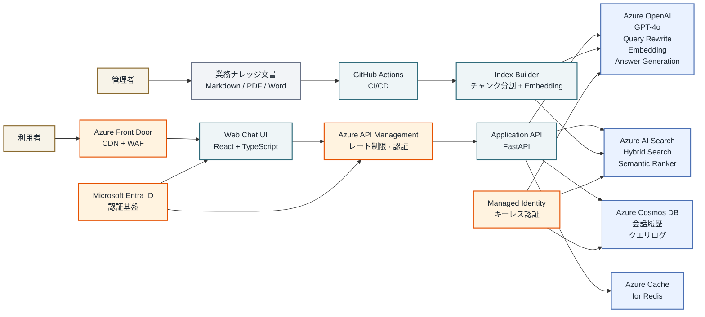
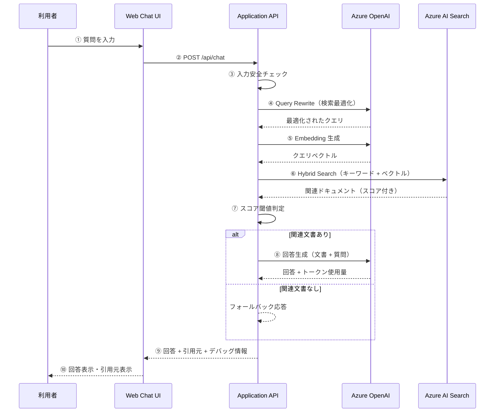
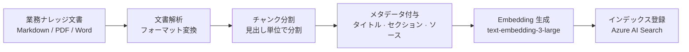
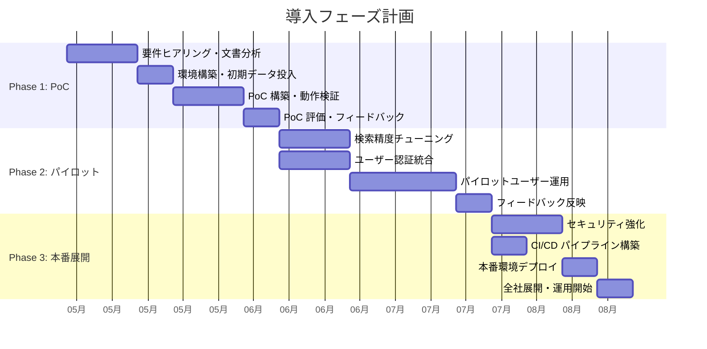
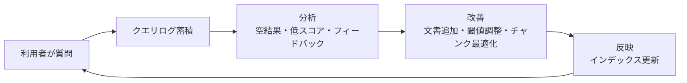

# Azure RAG ナレッジ検索 AI アシスタント — ご提案資料

---

## 1. エグゼクティブサマリー

### 1.1 プロジェクト概要

本システムは、企業内に蓄積されたナレッジ文書（業務マニュアル・FAQ・API 仕様・運用手順書など）を対象に、**自然言語で質問するだけで的確な回答と根拠を即座に返す AI 検索アシスタント**です。

Azure OpenAI と Azure AI Search を基盤とした **RAG（Retrieval-Augmented Generation）** アーキテクチャにより、社内情報に特化した高精度な回答を実現します。

### 1.2 解決する課題

| 現状の課題 | 本システムによる解決 |
|-----------|-------------------|
| 社内ナレッジが散在し、必要な情報を探すのに時間がかかる | 自然言語で質問するだけで、関連文書から回答を自動生成 |
| 新人・異動者が業務知識を習得するまでに時間がかかる | 即座に回答 + 根拠文書を提示し、自己解決を促進 |
| 問い合わせ対応が属人化している | AI が一次回答を担当し、担当者の負荷を軽減 |
| キーワード検索では意図に合った結果が得られない | 意味検索 + キーワード検索のハイブリッドで高精度な検索を実現 |
| 回答の根拠が不明で信頼性に不安がある | 必ず引用元を提示し、回答の透明性を担保 |

### 1.3 主な特徴

- **高精度 RAG 回答**: Azure OpenAI (GPT-4o) による自然で正確な回答生成
- **ハイブリッド検索**: キーワード検索 + ベクトル検索の融合で、固有名詞にも意味検索にも対応
- **引用元の明示**: 回答の根拠となった文書を必ず提示し、信頼性を確保
- **ハルシネーション防止**: 関連文書がない場合は「わかりません」と明示し、誤情報を防止
- **Azure ネイティブ**: Microsoft Azure サービスを中心に構成し、エンタープライズレベルのセキュリティと信頼性を実現

---

## 2. システム機能一覧

### 2.1 エンドユーザー向け機能

| 機能 | 説明 |
|------|------|
| 自然言語質問 | 日本語で自由に質問を入力可能 |
| AI 回答生成 | 社内ナレッジに基づいた的確な回答を自動生成 |
| 引用元表示 | 回答の根拠となった文書名・セクションを表示 |
| 会話履歴 | 過去の質問・回答を保持し、いつでも参照可能 |
| 複数セッション管理 | 用途別に会話を分けて管理 |
| フォールバック応答 | 回答不能な場合は明確にその旨を通知 |

### 2.2 管理者向け機能

| 機能 | 説明 |
|------|------|
| ナレッジ文書管理 | Markdown / PDF / Word 形式の文書を登録・更新 |
| インデックス再構築 | 文書追加・更新時にワンクリックで検索インデックスを更新 |
| 検索デバッグ | 検索結果のスコア・ヒット件数を確認し、品質チューニングに活用 |
| トークン使用量確認 | API 呼び出しのトークン消費量をリアルタイム確認 |
| レイテンシ監視 | 各ステップの処理時間を可視化 |

### 2.3 最終成果物で追加される機能（ロードマップ）

| 機能 | 説明 |
|------|------|
| マルチターン対話 | 前の質問の文脈を踏まえた連続的な対話 |
| ユーザー認証 | Microsoft Entra ID によるシングルサインオン |
| RBAC 権限制御 | 部門・役職に応じたドキュメントアクセス制御 |
| ユーザーフィードバック | 👍/👎 による回答品質の継続的改善 |
| 自動インデックス更新 | 文書変更を検知し自動的にインデックスを更新 |
| 多言語対応 | 日本語・英語・中国語等の多言語ナレッジ対応 |

---

## 3. 技術アーキテクチャ

### 3.1 全体構成



### 3.2 オンライン問答フロー

利用者が質問してから回答を受け取るまでの処理の流れです。



### 3.3 ナレッジ投入フロー

業務ナレッジ文書を検索可能にするまでの処理の流れです。



### 3.4 技術スタック

| レイヤー | 技術 | 選定理由 |
|---------|------|---------|
| フロントエンド | React + TypeScript + Vite | 型安全性・高速ビルド・豊富なエコシステム |
| バックエンド | Python + FastAPI + Pydantic | 非同期処理・自動 API ドキュメント・型検証 |
| LLM | Azure OpenAI (GPT-4o) | 高精度な日本語対応・エンタープライズ SLA |
| Embedding | text-embedding-3-large (3072次元) | 最新モデル・日本語の意味的類似性に優れる |
| 検索 | Azure AI Search (Hybrid + Semantic Ranker) | キーワード + ベクトル融合・RRF スコアリング |
| 認証 | Microsoft Entra ID + MSAL | SSO・MFA・既存 AD 連携 |
| データベース | Azure Cosmos DB (Serverless) | 低コスト・グローバル分散・柔軟なスキーマ |
| キャッシュ | Azure Cache for Redis | 高速応答・セッション管理 |
| IaC | Azure Bicep | Azure ネイティブ・宣言型・再現性 |
| CI/CD | GitHub Actions | 自動テスト・自動デプロイ・承認フロー |

---

## 4. RAG アーキテクチャの技術的優位性

### 4.1 なぜ RAG を採用するのか

```
一般的な ChatGPT の課題:
  ❌ 社内情報を知らない
  ❌ 古い情報で回答する可能性がある
  ❌ 回答の根拠が不明
  ❌ 機密情報の漏洩リスク

RAG による解決:
  ✅ 社内文書をリアルタイムに参照して回答
  ✅ 文書を更新すれば回答も最新化
  ✅ 引用元を必ず提示
  ✅ Azure 閉域内でデータを処理（外部送信なし）
```

### 4.2 Classic RAG vs Agentic Retrieval

| 項目 | Classic RAG（本システム採用） | Agentic Retrieval |
|------|---------------------------|-------------------|
| 制御性 | 高い（処理フロー固定） | 低い（LLM が動的に判断） |
| コスト | 予測しやすい | 変動大 |
| レイテンシ | 安定（1〜3秒） | 不安定（5〜15秒） |
| デバッグ | 容易 | 困難 |
| 適用場面 | FAQ・マニュアル検索 | 複雑な多段推論 |

本システムでは Classic RAG を採用し、**安定性・制御性・コスト予測性**を重視しています。

### 4.3 ハイブリッド検索の仕組み

```
ユーザー質問: 「スカウトメールの送信上限は？」

  キーワード検索:
    → 「スカウト」「送信」「上限」で完全一致検索
    → 固有名詞や略語に強い

  ベクトル検索:
    → 質問全体の意味を数値ベクトル化
    → 「スカウト機能の利用制限について」等の類似文書もヒット

  RRF（Reciprocal Rank Fusion）:
    → 両方の結果をスコア統合
    → 片方だけでは見つからない文書も発見
```

### 4.4 Query Rewrite（クエリ書き換え）

```
ユーザー入力:
  「P1障害が起きたときどうすればいいですか」

GPT-4o による書き換え:
  「P1障害 対応手順 インシデント エスカレーション」

効果:
  ・「〜ですか」等のノイズを除去
  ・検索に有効なキーワードを抽出
  ・検索精度が向上
```

---

## 5. セキュリティ設計

### 5.1 セキュリティレイヤー

本システムは多層防御（Defense in Depth）の原則に基づき設計されています。

| レイヤー | 対策 | 詳細 |
|---------|------|------|
| エッジ防御 | Azure Front Door WAF | DDoS 防御・IP 制限・Bot 検出 |
| 認証 | Microsoft Entra ID | OAuth 2.0 / OIDC・MFA・SSO |
| API ゲートウェイ | Azure API Management | レート制限・JWT 検証・バージョン管理 |
| アプリケーション | CORS + Content Safety | Prompt Injection 防御・入出力フィルタリング |
| サービス間 | Managed Identity | キーレス認証（API Key 不使用） |
| ネットワーク | VNet + Private Endpoint | Azure サービス間の通信を閉域化 |
| 鍵管理 | Azure Key Vault | 暗号鍵・証明書の一元管理・自動ローテーション |
| 通信 | TLS 1.2+ | エンドツーエンド暗号化 |

### 5.2 データの取り扱い

| 項目 | 方針 |
|------|------|
| 社内文書 | Azure 閉域内で処理。外部サービスへのデータ送信なし |
| ユーザー質問 | Azure OpenAI に送信されるが、学習には使用されない |
| 会話履歴 | Azure Cosmos DB に保存。ユーザー単位でアクセス制御 |
| ログ | Azure Log Analytics に保管。保持期間設定可能 |

### 5.3 認証フェーズロードマップ

```
Phase 1（現在）: API Key + CORS 制限
    → PoC 環境での開発・検証用

Phase 2（近期）: Managed Identity
    → サービス間のキーレス化・API Key 廃止

Phase 3（中期）: Microsoft Entra ID
    → ユーザー認証・SSO・MFA

Phase 4（長期）: RBAC
    → 部門別ドキュメント権限・監査ログ
```

---

## 6. 導入効果

### 6.1 定量的効果（想定）

| 指標 | 現状 | 導入後（想定） | 改善率 |
|------|------|-------------|--------|
| 情報検索にかかる時間 | 平均 15〜30 分 | 平均 1〜3 分 | 80〜90% 削減 |
| 問い合わせ対応件数 | 月 200 件以上 | 月 50〜80 件 | 60〜75% 削減 |
| 新人の業務知識習得期間 | 2〜3 ヶ月 | 1〜2 ヶ月 | 30〜50% 短縮 |
| ナレッジ検索の正答率 | キーワード依存で不安定 | 80〜90%（ハイブリッド検索） | 大幅改善 |

### 6.2 定性的効果

- **属人化の解消**: ベテラン社員に頼らず、誰でも必要な情報にアクセス可能
- **業務品質の均一化**: 同じ質問には一貫した回答を提供
- **ナレッジの資産化**: 散在する暗黙知を体系化し、組織の知的資産として蓄積
- **働き方改革**: 情報検索の時間削減により、本来の業務に集中可能

---

## 7. 導入ステップ

### 7.1 フェーズ計画



### 7.2 各フェーズの詳細

| フェーズ | 期間 | 主な成果物 | ゴール |
|---------|------|----------|--------|
| Phase 1: PoC | 約 6 週間 | 動作するプロトタイプ | 技術的実現性の確認・経営層承認 |
| Phase 2: パイロット | 約 6 週間 | パイロット版 | 特定部門での実運用検証・精度改善 |
| Phase 3: 本番展開 | 約 4 週間 | 本番システム | 全社展開・運用体制確立 |

### 7.3 お客様にご準備いただくもの

| 項目 | 詳細 |
|------|------|
| Azure サブスクリプション | Azure OpenAI・AI Search 等のリソース作成用 |
| ナレッジ文書 | 検索対象とする業務マニュアル・FAQ 等 |
| Microsoft Entra ID テナント | ユーザー認証用（Phase 2 以降） |
| ステークホルダー | プロジェクトオーナー・業務部門の窓口担当 |
| フィードバック体制 | パイロット期間中の評価・改善要望の収集 |

---

## 8. 運用・保守

### 8.1 日常運用

| 項目 | 頻度 | 内容 |
|------|------|------|
| ナレッジ文書更新 | 随時 | Markdown / PDF / Word を追加・更新 |
| インデックス更新 | 自動（文書更新時） | GitHub Actions による自動再インデックス |
| 利用状況モニタリング | 毎日 | ダッシュボードで KPI 確認 |
| 検索品質レビュー | 週次 | 空結果率・スコア分布の確認 |
| コスト確認 | 月次 | Azure リソースの使用量・課金額確認 |

### 8.2 監視・アラート

| 監視項目 | 閾値 | アラート先 |
|---------|------|----------|
| P95 レイテンシ | > 5 秒 | 運用チーム |
| エラー率 | > 5% | 運用チーム |
| 空結果率 | > 30% | ナレッジ管理チーム |
| Azure OpenAI トークン消費 | 月間上限の 80% | プロジェクトオーナー |
| 不正アクセス試行 | 検出時 | セキュリティチーム |

### 8.3 継続的改善サイクル



---

## 9. コスト試算

### 9.1 Azure リソース月額目安

| リソース | SKU | 月額目安（税抜） | 備考 |
|---------|-----|---------------|------|
| Azure OpenAI Service | S0 | ¥30,000〜¥80,000 | トークン使用量に依存 |
| Azure AI Search | Basic | ¥10,000〜¥15,000 | インデックスサイズに依存 |
| Azure App Service | B2 | ¥8,000〜¥12,000 | auto-scale 設定次第 |
| Azure Static Web Apps | Standard | ¥1,500 | フロントエンドホスティング |
| Azure Cosmos DB | Serverless | ¥2,000〜¥5,000 | リクエスト数に依存 |
| Azure Cache for Redis | Basic | ¥3,000 | C0 インスタンス |
| Azure Front Door | Standard | ¥5,000〜¥10,000 | トラフィック量に依存 |
| Azure API Management | Consumption | ¥0〜¥5,000 | 呼び出し数に依存 |
| その他（Key Vault, Log Analytics 等） | — | ¥2,000〜¥5,000 | — |
| **合計** | — | **¥60,000〜¥150,000** | ユーザー数・利用頻度に依存 |

※ 上記は 50〜200 名規模、月間 5,000〜20,000 クエリを想定した目安です。

### 9.2 コスト最適化のポイント

- **Redis キャッシュ**: よくある質問をキャッシュし、OpenAI API 呼び出しを削減
- **Serverless 構成**: Cosmos DB・API Management を Serverless にし、従量課金で無駄を削減
- **Embedding バッチ処理**: 文書投入時にまとめて処理し、API 呼び出し回数を最適化
- **auto-scale**: トラフィックに応じた自動スケーリングで過剰プロビジョニングを防止

---

## 10. よくあるご質問（FAQ）

### Q1. 既存の社内システム（SharePoint・Confluence 等）と連携できますか？

**A.** はい。ナレッジパイプラインを拡張することで、SharePoint・Confluence・Notion 等から文書を自動取得し、インデックスに投入する構成が可能です。Phase 2 以降での対応を推奨します。

### Q2. 社内データが外部に漏洩するリスクはありますか？

**A.** Azure OpenAI Service はお客様のデータをモデル学習に使用しません（Microsoft の契約条項に明記）。また、全通信は Azure 閉域内で完結し、Private Endpoint による通信暗号化を適用します。

### Q3. 回答の精度はどの程度ですか？

**A.** ナレッジ文書の品質と網羅性に依存しますが、一般的に 80〜90% 程度の正答率が期待できます。PoC フェーズで実データを使って精度を検証し、チューニングを行います。

### Q4. 多言語対応は可能ですか？

**A.** はい。Azure OpenAI (GPT-4o) および text-embedding-3-large は日本語・英語・中国語等の多言語に対応しています。ナレッジ文書を各言語で用意すれば、多言語検索が可能です。

### Q5. 既存の Microsoft 365 / Entra ID 環境と統合できますか？

**A.** はい。Microsoft Entra ID (旧 Azure AD) と MSAL による SSO 認証に対応予定です。既存の Microsoft 365 アカウントでそのままログインできます。

### Q6. 回答が間違っていた場合はどうなりますか？

**A.** 本システムは必ず引用元を提示するため、利用者が自分で根拠を確認できます。また、ユーザーフィードバック機能（👍/👎）により、回答品質の継続的な改善が可能です。関連文書がない場合は「該当する情報が見つかりませんでした」と明示し、根拠のない回答（ハルシネーション）を防止します。

### Q7. PoC にはどのくらいの期間・費用がかかりますか？

**A.** PoC は約 6 週間で構築可能です。Azure リソース費用は月額 ¥10,000〜¥30,000 程度（PoC 規模）、構築費用は別途お見積もりとなります。

### Q8. 導入後のサポート体制はどうなりますか？

**A.** 運用マニュアル・監視ダッシュボード・アラート設定を含めて納品します。保守契約により、検索精度チューニング・文書投入支援・障害対応を継続的にサポートします。

---

## 11. なぜ当社を選ぶべきか

| 強み | 詳細 |
|------|------|
| Azure ネイティブ設計 | Azure OpenAI・AI Search を中心とした最適アーキテクチャ |
| フルスタック対応 | フロントエンド・バックエンド・インフラ・CI/CD まで一貫対応 |
| ドキュメント重視 | アーキテクチャ設計書・API 仕様書・運用手順書を完備 |
| セキュリティファースト | 多層防御・Managed Identity・Private Endpoint を標準装備 |
| 段階的導入 | PoC → パイロット → 本番の段階的アプローチで低リスク |
| 継続的改善 | フィードバックループによる検索精度の継続的向上 |

---

## 12. 次のステップ

1. **ヒアリング**: 対象業務・ナレッジ文書の現状確認
2. **PoC スコープ定義**: 検証範囲・成功基準の合意
3. **Azure 環境準備**: サブスクリプション・リソースグループ作成
4. **PoC 開始**: 約 6 週間で動作するプロトタイプを構築

---

> 本資料に関するご質問・ご相談がございましたら、お気軽にお問い合わせください。
