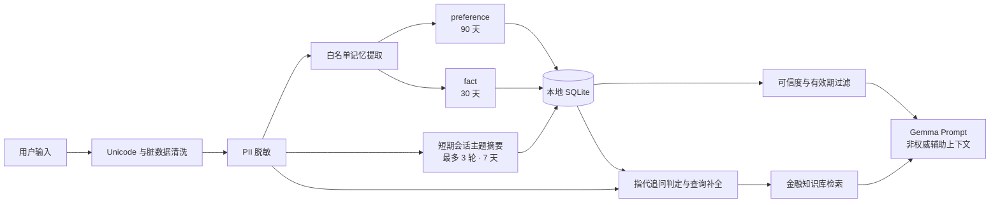

# P5 会话记忆治理

## 目标

P5 不是把全部聊天记录原样送回模型，而是在下一次对话前建立一个受治理的记忆层：先清洗和脱敏，再保存明确的长期 preference / fact，以及同一会话内的短期主题摘要。两类记忆都可过期、可查看、可删除、可按请求关闭。

## 数据流程



## 保存什么

| 类型 | 触发方式 | 默认可信度 | 默认有效期 | 用途 |
|---|---|---:|---:|---|
| `preference` | 明确要求中文/日语/英语、简洁/详细回答 | 0.85–0.90 | 90 天 | 仅调整回答格式 |
| `fact` | 明确使用“请记住：”“覚えておいて”“remember that” | 0.90 | 30 天 | 低风险用户背景辅助 |
| `summary` | 成功处理普通问题后，保存脱敏后的最近会话主题 | 1.00 | 7 天 | 仅在“刚才那个规定”“それ”“what about”类追问中补全搜索问题 |

系统不会把普通问题自动推断成长期事实，也不会保存原始聊天全文或模型回答。短期摘要只保留同一 `client_id + conversation_id` 当前主题链中最近 3 个、每个最多 300 字的脱敏问题。遇到独立的新问题会重置主题链，避免旧主题污染后续检索。

## 不保存什么

- 邮箱、电话、邮编、账号、客户编号、10–19 位长数字
- 包含 PII 占位符的记忆候选
- Prompt Injection、系统提示词提取等 Memory Poisoning 内容
- HTML 标签、控制字符、零宽字符、超长或大量重复字符
- 模型生成的回答、引用内容或模型自行推断的用户属性

旧版浏览器 `localStorage` 中的问题和回答在加载时也会执行基础 PII 清洗，并覆盖为清洗后的历史记录。

## PII 处理

当前使用确定性规则替换为：

- `[EMAIL]`
- `[PHONE]`
- `[POSTAL_CODE]`
- `[ACCOUNT_NUMBER]`
- `[LONG_NUMBER]`

清洗后的问题用于检索、Gemma 生成、API 的 `sanitized_question` 以及新的浏览器历史。原始 PII 不进入 SQLite 记忆数据库。

## 记忆如何提供给模型

浏览器首次启动时生成匿名 `client_id`，每个聊天会话使用独立 `conversation_id`。同一浏览器的新会话可以读取仍有效的记忆。

preference / fact 在 Prompt 中被标记为 `<governed_memory>`；短期摘要不作为回答证据，只在检测到指代式追问时补全检索问题。边界如下：

- `preference` 只能控制语言和详略程度。
- `fact` 不能成为金融规定、产品条件或业务判断依据。
- 金融知识文档始终优先于会话记忆。
- 会话记忆不能生成 `[S#]` Citation。
- 只有白名单 preference 会转换为格式指令；任意 fact 永远不会提升为 system 指令。
- `summary` 只包含用户问题主题，不保存模型回答或知识文档正文。
- 普通独立问题不使用旧摘要，并会建立新的当前主题。

当前 Gemma 3 4B 在“日语问题 + 日语证据”场景中可能继续使用日语，即使存在中文 preference。因此语言 preference 是软约束。P5 不追加第二次翻译调用，以避免双倍延迟和翻译阶段引入事实偏差。

## 用户控制

前端导航栏的 `Memory` 按钮可查看：

- 类型：`preference` / `fact`
- 类型：`summary`（短期会话主题）
- 保存值
- 可信度
- 有效期
- 单条删除

用户可以按请求关闭记忆，也可以删除单条记忆或当前浏览器的全部记忆。删除单个聊天记录时，也会请求删除该会话对应的服务端记忆。启用本地 JWT 时，Token 的 `sub` 是记忆所有者，客户端传入的 `client_id` 不作为跨用户访问依据。

API：

```text
GET    /api/memory?client_id=...
DELETE /api/memory?client_id=...
DELETE /api/memory?client_id=...&conversation_id=...
DELETE /api/memory/items/{item_id}?client_id=...
POST   /api/memory/cleanup
```

## 配置

```dotenv
MEMORY_ENABLED=true
MEMORY_DB_PATH=output/memory/conversation-memory.sqlite3
MEMORY_PREFERENCE_TTL_DAYS=90
MEMORY_FACT_TTL_DAYS=30
MEMORY_SUMMARY_TTL_DAYS=7
MEMORY_SUMMARY_MAX_TURNS=3
MEMORY_MAX_ITEMS=12
```

SQLite 文件属于本地运行数据，已通过 `.gitignore` 排除。

## 验证结果

- PII 清洗与脏数据压缩：通过
- Preference / Fact 分类：通过
- PII 与 Memory Poisoning 不入库：通过
- 可信度、TTL、upsert、过期清理：通过
- 跨会话读取：通过
- 查看、单条删除、按会话删除、全部删除：通过
- 请求级 ON/OFF 与认证用户所有权：通过
- 指代式追问查询补全、新主题重置、最多轮数限制：通过
- 摘要的 PII 拒绝、单条删除、按会话删除、全部删除：通过
- 真实 Gemma 调用：`context_items=2`、`stored_items=0`、`fallback_used=false`
- 删除验证：测试数据 `deleted=2`

## 当前限制

- `client_id` 是浏览器匿名标识，不是登录身份或安全授权边界。
- SQLite 当前未加密，只适合本地 PoC；生产环境需要加密、访问控制与审计。
- 规则式 PII 检测不能覆盖姓名、自然语言地址和所有地区格式。
- 自动提取仅覆盖白名单表达，避免错误记忆；覆盖率低于通用 LLM 抽取。
- 语言和风格偏好最终仍受本地模型指令服从能力影响。
- 指代追问当前采用中日英规则识别；过于隐含且没有指代词的追问可能不会触发补全。
