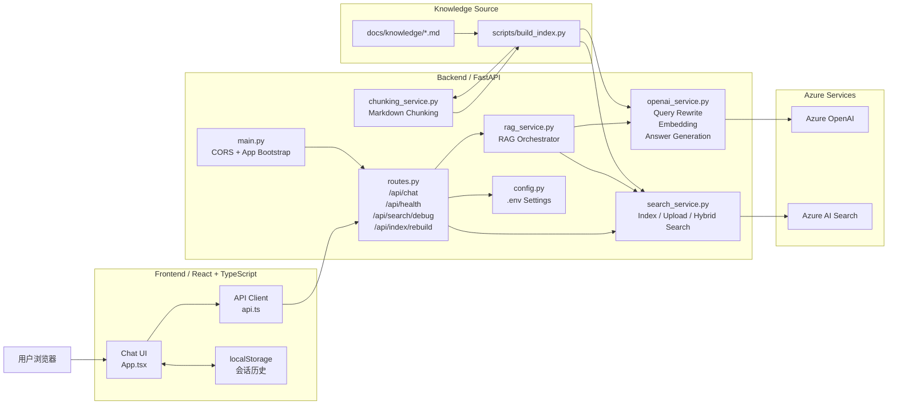
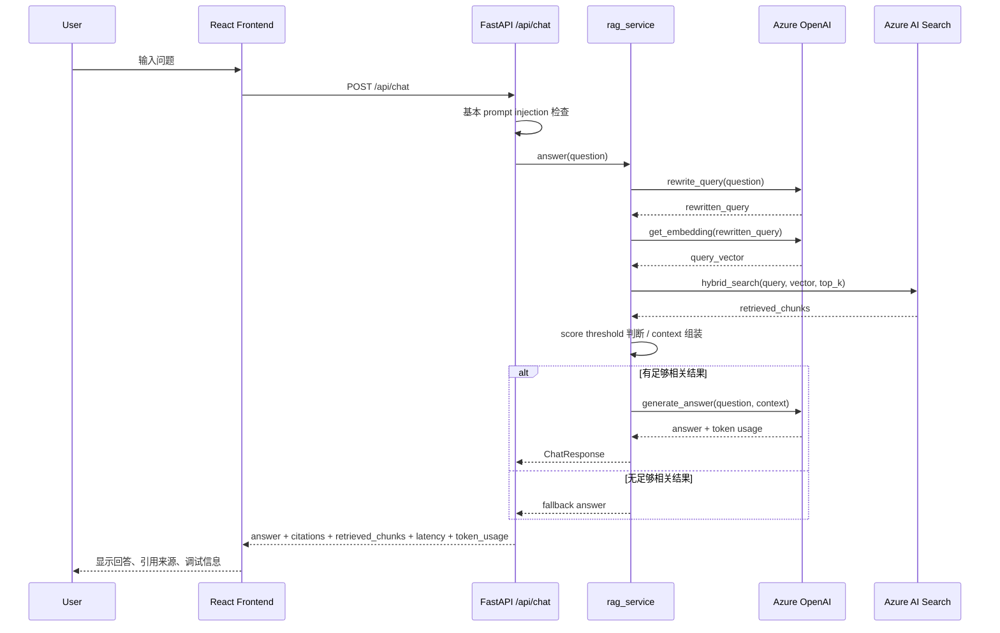
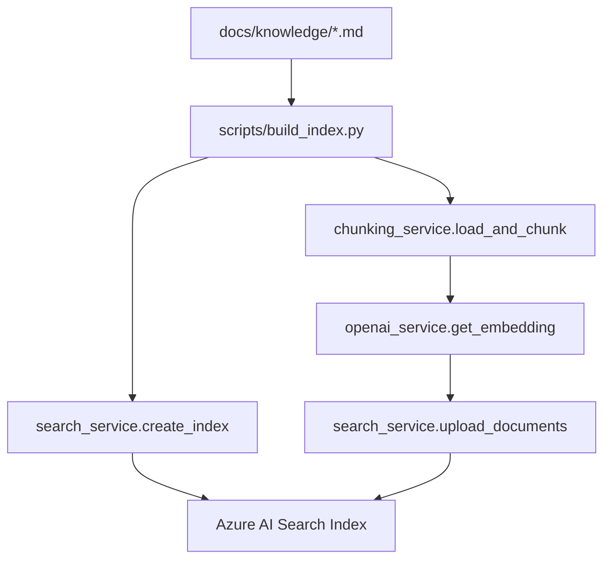

# 当前项目系统架构

本文描述当前仓库已经实现的系统架构，重点基于现有代码，而不是未来理想形态。  
当前系统已经从 Day 1 的纯 mock 骨架，演进为一个具备以下能力的本地优先 RAG 应用：

- React + TypeScript 聊天前端
- FastAPI 后端 API
- Azure OpenAI 查询改写、Embedding、答案生成
- Azure AI Search Hybrid Search
- Markdown 知识文档切分与索引构建脚本
- 本地会话历史保存与调试信息展示

## 1. 架构总览

## 2. 运行时架构

### 2.1 前端

前端位于 `frontend/src/`，核心职责如下：

- `App.tsx`
  - 提供聊天界面
  - 管理消息列表、loading、error、开发调试面板显示
  - 管理会话历史、新建会话、切换会话、删除会话
  - 将会话数据写入浏览器 `localStorage`
- `api.ts`
  - 统一封装对后端 `/api/chat` 的调用
  - 统一处理错误返回
- `types.ts`
  - 定义 `ChatResponse`、`Citation`、`RetrievedChunk`、`TokenUsage`、`Message`

当前前端不是简单单页 demo，而是一个带有“会话管理 + 调试视图 + 引用展示”的轻量聊天客户端。

### 2.2 后端

后端位于 `backend/app/`，主要分为以下层次：

- `main.py`
  - 启动 FastAPI
  - 配置 CORS
  - 注册路由
- `api/routes.py`
  - 暴露 HTTP API
  - 做基本输入安全检查
  - 调用 RAG 服务或索引服务
- `services/rag_service.py`
  - 编排完整的 RAG 问答流程
  - 负责 fallback、citation 组装、token usage 返回
- `services/openai_service.py`
  - 负责 query rewrite
  - 负责 embedding
  - 负责最终答案生成
- `services/search_service.py`
  - 负责 Azure AI Search 索引创建、删除、上传、hybrid search
- `services/chunking_service.py`
  - 负责 Markdown 文档分块
- `services/config.py`
  - 统一加载 `.env` 配置
- `models/chat.py`
  - 定义请求响应模型

后端采用了比较清晰的“路由层 -> 服务层 -> 外部服务”结构，便于你在面试里强调职责分离和后续扩展性。

## 3. 在线问答链路

当前 `/api/chat` 的主流程如下：

### 3.1 问答链路说明

1. 前端将用户输入提交到 `POST /api/chat`
2. 路由层先执行基础 prompt injection 检测
3. `rag_service.answer()` 先调用 Azure OpenAI 做查询改写
4. 再对改写后的 query 做 embedding
5. 后端将 keyword query + vector query 一起送入 Azure AI Search
6. Azure AI Search 返回 hybrid search 结果
7. 后端根据 top score 判断是否走 fallback
8. 若结果可用，则拼接 context，再调用 Azure OpenAI 生成最终回答
9. 后端将回答、引用、检索片段、改写后的 query、token 用量、耗时一起返回前端

### 3.2 当前返回模型

`POST /api/chat` 当前返回：

- `answer`
- `citations`
- `retrieved_chunks`
- `latency_ms`
- `rewritten_query`
- `token_usage`

这说明当前系统已经不再只是“问一句答一句”的最小 demo，而是具备了调试和可解释性字段。

## 4. 索引构建链路

当前系统还实现了知识文档到 Azure AI Search 的离线构建流程。

### 4.1 索引流程说明

1. `scripts/build_index.py` 读取 `docs/knowledge/` 下的 Markdown 文档
2. `chunking_service.py` 以 `##` 二级标题为边界进行分块
3. 每个 chunk 生成：
   - `chunk_id`
   - `title`
   - `section`
   - `source`
   - `content`
4. 后端调用 Azure OpenAI 为每个 chunk 生成 embedding
5. 后端调用 Azure AI Search 创建或更新索引
6. 最后将 chunk 文档批量上传到 Azure AI Search

### 4.2 当前索引字段

当前索引字段包括：

- `chunk_id`
- `title`
- `section`
- `source`
- `content`
- `content_vector`

其中 `content_vector` 当前按 `text-embedding-3-large` 的维度配置为 `3072`。

## 5. 配置与外部依赖

### 5.1 当前配置来源

当前配置统一由 `backend/app/services/config.py` 从环境变量读取，主要包括：

- `AZURE_OPENAI_ENDPOINT`
- `AZURE_OPENAI_API_KEY`
- `AZURE_OPENAI_CHAT_DEPLOYMENT`
- `AZURE_OPENAI_EMBEDDING_DEPLOYMENT`
- `AZURE_SEARCH_ENDPOINT`
- `AZURE_SEARCH_API_KEY`
- `AZURE_SEARCH_INDEX_NAME`
- `TOP_K`
- `MAX_CHUNKS`

### 5.2 当前外部依赖关系

- 前端依赖后端 API
- 后端依赖 Azure OpenAI
- 后端依赖 Azure AI Search
- 索引构建脚本依赖 `docs/knowledge/*.md`

## 6. 当前系统的非功能特征

### 6.1 已具备的工程特征

- 前后端分离
- 配置外置
- 基础异常处理
- 会话历史本地保存
- 调试信息返回
- 引用来源展示
- 索引构建脚本独立
- API 测试存在

### 6.2 当前限制

- 用户认证尚未接入
- Azure 服务访问仍以 API Key 为主
- prompt injection 防护还只是基础关键字检查
- chunking 规则较简单，目前按二级标题切分
- 没有完整的 observability，如 tracing、metrics、dashboard
- 会话历史只保存在浏览器，不做服务端持久化

## 7. 面试时可用的架构总结

可以直接这样讲：

> 当前这个项目采用前后端分离架构。前端使用 React + TypeScript，负责聊天交互、引用展示、会话历史和调试信息展示；后端使用 FastAPI，负责请求校验、RAG 编排、Azure OpenAI 调用和 Azure AI Search 检索。  
> 在线链路上，系统先做 query rewrite，再生成 embedding，之后执行 hybrid search，最后根据检索结果组装上下文并生成答案。  
> 离线链路上，系统从 Markdown 知识文档生成 chunk，补充 metadata 和 embedding 后写入 Azure AI Search。  
> 这使得系统既有在线问答能力，也有离线索引构建能力，整体上已经具备 PoC 到可持续扩展架构的基础形态。

## 8. 相关代码与文档

- 前端入口：`frontend/src/App.tsx`
- 前端 API 封装：`frontend/src/api.ts`
- 前端类型：`frontend/src/types.ts`
- 后端入口：`backend/main.py`
- API 路由：`backend/app/api/routes.py`
- RAG 编排：`backend/app/services/rag_service.py`
- Azure OpenAI：`backend/app/services/openai_service.py`
- Azure AI Search：`backend/app/services/search_service.py`
- Chunking：`backend/app/services/chunking_service.py`
- 索引脚本：`backend/scripts/build_index.py`
- 认证设计补充：`docs/auth-design.md`
- 设计取舍补充：`docs/design-decisions.md`

