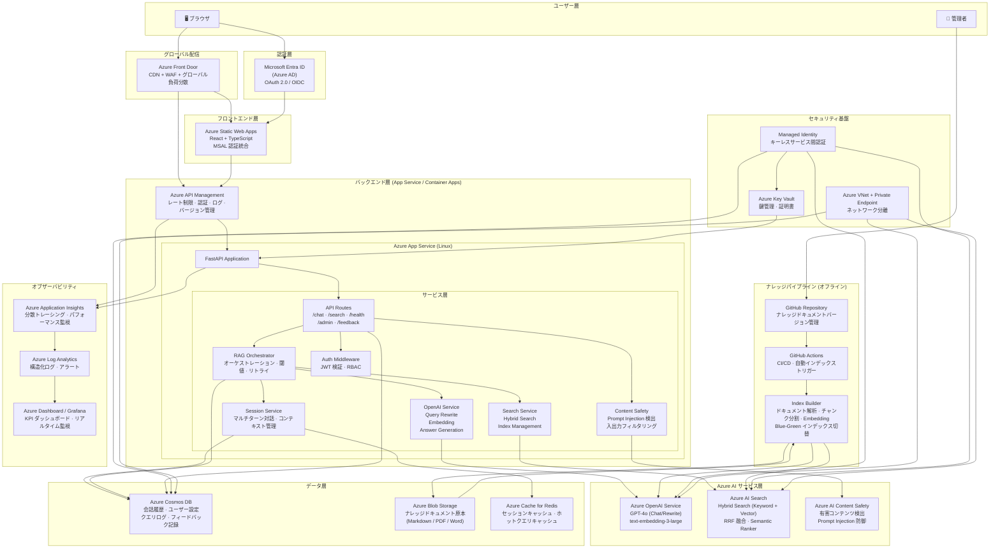
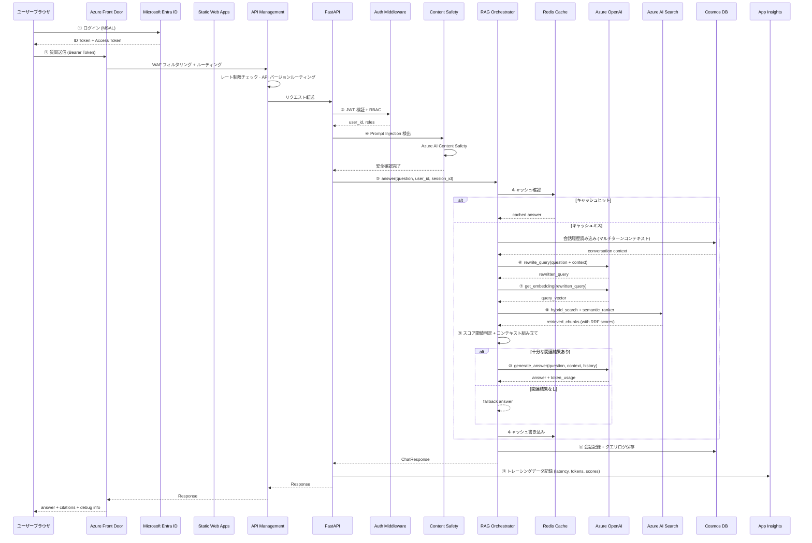
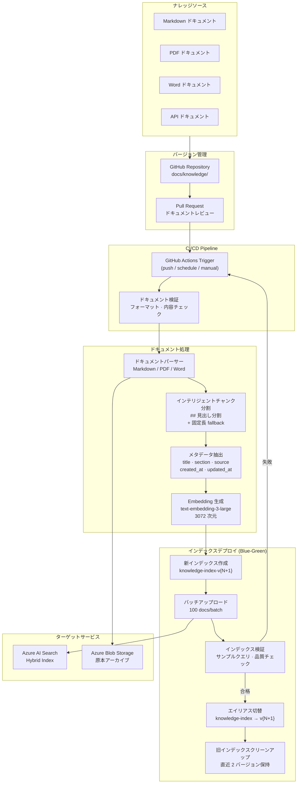
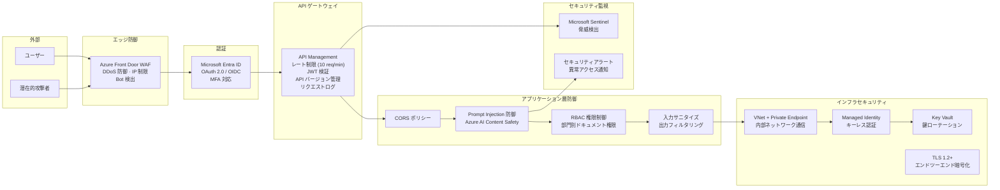
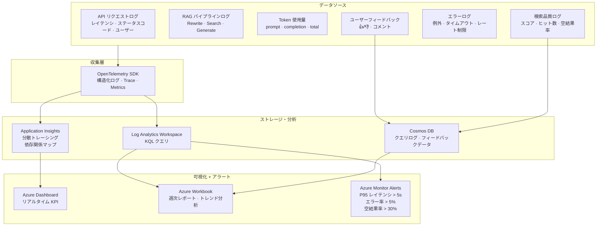
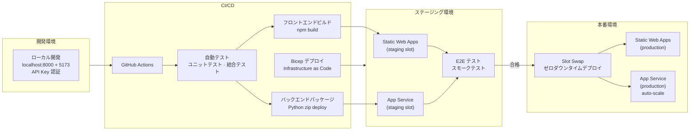

# 最終成果物 システムアーキテクチャ図

本ドキュメントは Azure RAG Knowledge Bot の現在の Demo から最終本番環境への完全なシステムアーキテクチャを記述します。

---

## 1. 最終全体アーキテクチャ図

---

## 2. オンライン質疑応答フロー（最終版）

---

## 3. ナレッジパイプラインアーキテクチャ（オフラインインデックス）

---

## 4. セキュリティアーキテクチャ

---

## 5. オブザーバビリティアーキテクチャ

---

## 6. デプロイアーキテクチャ

---

## 7. Demo → 最終成果物 対照表

| 項目 | 現在の Demo | 最終成果物 |
|------|-----------|----------|
| **フロントエンドホスティング** | localhost:5173 (Vite dev) | Azure Static Web Apps + Front Door CDN |
| **バックエンドホスティング** | localhost:8000 (Uvicorn) | Azure App Service (auto-scale) + API Management |
| **認証** | なし | Microsoft Entra ID + MSAL + JWT |
| **サービス間認証** | API Key (.env) | Managed Identity (キーレス) |
| **セッション管理** | ブラウザ localStorage | Cosmos DB + Redis Cache |
| **対話能力** | シングルターン質疑応答 | マルチターン対話 (コンテキスト記憶) |
| **コンテンツ安全性** | 基本キーワードマッチング | Azure AI Content Safety |
| **レート制限** | なし | API Management + slowapi |
| **ナレッジソース** | Markdown のみ | Markdown + PDF + Word |
| **インデックス更新** | 手動 build_index.py | GitHub Actions 自動トリガー + Blue-Green デプロイ |
| **ログ** | プレーンテキスト print | OpenTelemetry → Application Insights |
| **監視** | なし | Dashboard + アラート + 週次レポート |
| **ネットワークセキュリティ** | パブリックアクセス | VNet + Private Endpoint |
| **CI/CD** | 手動デプロイ | GitHub Actions + Staging Slot + Swap |
| **鍵管理** | .env ファイル | Azure Key Vault |
| **検索強化** | Hybrid Search (RRF) | + Semantic Ranker |
| **ユーザーフィードバック** | なし | 👍/👎 フィードバック → 品質分析クローズドループ |

---

## 8. Azure リソース一覧（最終成果物）

| リソース | SKU / ティア | 用途 |
|---------|-----------|------|
| Azure Front Door | Standard | CDN + WAF + グローバルルーティング |
| Azure Static Web Apps | Standard | フロントエンドホスティング |
| Azure App Service | B2+ (auto-scale) | バックエンド API |
| Azure API Management | Consumption / Basic | API ゲートウェイ |
| Azure OpenAI Service | S0 | GPT-4o + Embedding |
| Azure AI Search | Basic+ | ハイブリッド検索 + Semantic Ranker |
| Azure AI Content Safety | S0 | コンテンツ安全フィルタリング |
| Azure Cosmos DB | Serverless | セッション · ログ · フィードバック |
| Azure Cache for Redis | Basic | キャッシュ |
| Azure Blob Storage | Hot | ナレッジドキュメントアーカイブ |
| Azure Key Vault | Standard | 鍵管理 |
| Azure Application Insights | — | APM + トレーシング |
| Azure Log Analytics | — | ログ分析 |
| Azure Monitor | — | アラート |
| Microsoft Entra ID | — | ID 認証 |
| GitHub Actions | — | CI/CD |
