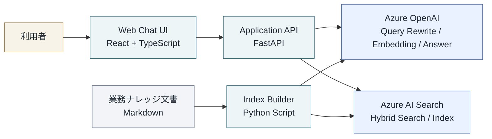

# 提案書向け簡易アーキテクチャ図

本資料は、現在の `Azure RAG Knowledge Bot` を提案書や PPT に貼りやすい形に簡略化したアーキテクチャ図です。  
詳細版は `docs/current-system-architecture.md` を参照してください。

## 1. 1枚で見せる簡易構成図



## 2. スライド用の短い説明

- 利用者は Web 画面から質問を入力し、回答と引用元を確認します。
- バックエンドは FastAPI で構成し、RAG の検索制御と Azure サービス連携を担当します。
- Azure OpenAI は query rewrite、embedding、回答生成を担当します。
- Azure AI Search はナレッジ索引と hybrid search を担当します。
- 知識文書は Markdown で管理し、Python スクリプトで索引へ投入します。

## 3. 提案書にそのまま貼れる説明文

```text
本システムは、React/TypeScript によるチャットフロントエンドと、FastAPI によるアプリケーション API を中心に構成されています。
利用者からの質問はバックエンドで受け取り、Azure OpenAI による query rewrite と回答生成、Azure AI Search による hybrid search を組み合わせて回答を返却します。
また、業務ナレッジは Markdown 文書として管理し、Python ベースの Index Builder を通じて Azure AI Search に登録する構成です。
```

## 4. 口头讲解版

```text
前端は React、バックエンドは FastAPI です。
質問時にはバックエンドが Azure OpenAI と Azure AI Search を連携させて RAG 応答を生成します。
ナレッジ更新時には Markdown 文書を Python スクリプトで読み込み、Embedding 生成後に Azure AI Search へ登録します。
```

